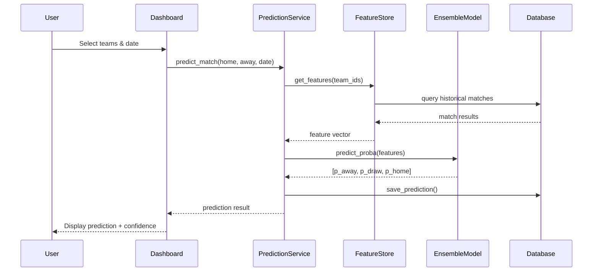
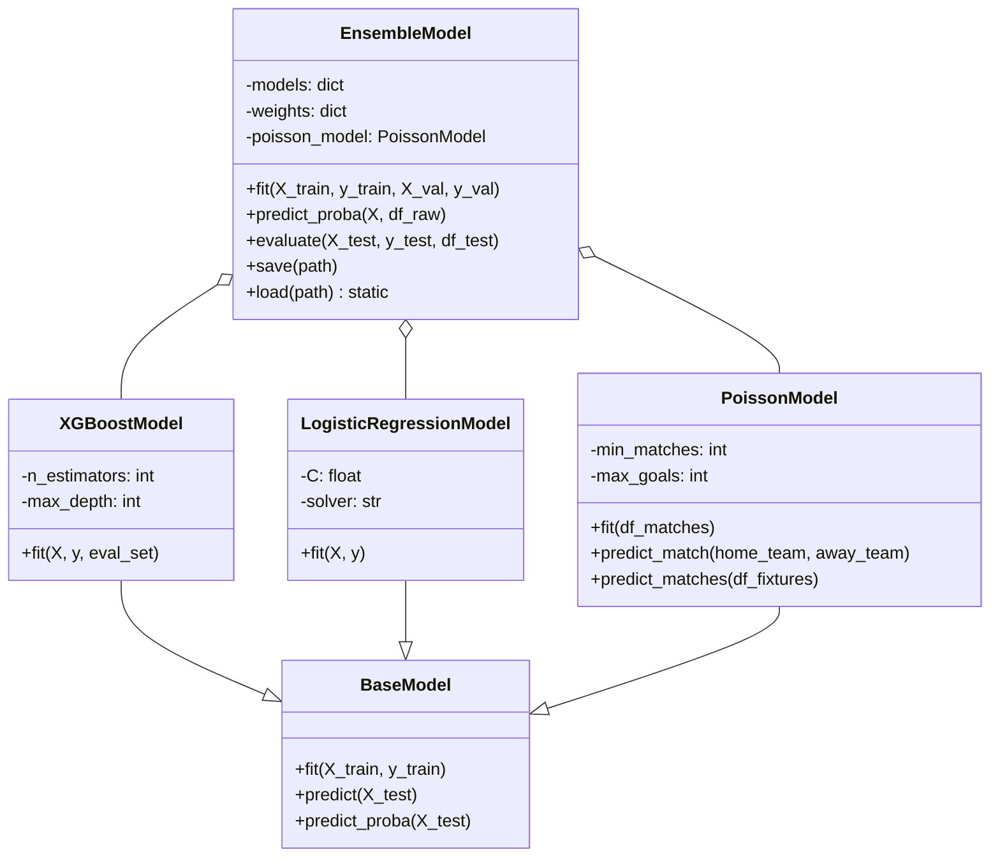

# Architecture

## System Architecture

```
┌────────────────────────────────────────────────────────────────────────────┐
│                        PRESENTATION LAYER                                   │
│  ┌───────────────┐  ┌──────────────┐  ┌──────────────┐  ┌──────────────┐  │
│  │ Streamlit     │  │ CLI Tools    │  │ REST API     │  │ HTML Reports │  │
│  │ Dashboard     │  │ (7 packages) │  │ FastAPI      │  │ Plotly       │  │
│  └───────┬───────┘  └──────┬───────┘  └──────┬───────┘  └──────┬───────┘  │
└──────────┼─────────────────┼──────────────────┼─────────────────┼──────────┘
           │                 │                  │                 │
┌──────────▼─────────────────▼──────────────────▼─────────────────▼──────────┐
│                          SERVICE LAYER                                      │
│  ┌──────────────────┐  ┌──────────────────┐  ┌────────────────────────┐   │
│  │ PredictionService │  │ TrainingService   │  │ ExperimentTracker      │   │
│  └────────┬─────────┘  └────────┬─────────┘  └───────────┬────────────┘   │
│  ┌────────▼─────────┐  ┌────────▼─────────┐  ┌───────────▼────────────┐   │
│  │ ValueBetting     │  │ Backtesting       │  │ ModelRegistry         │   │
│  └──────────────────┘  └──────────────────┘  └────────────────────────┘   │
└────────────────────────────────────────────────────────────────────────────┘
                              │
┌─────────────────────────────▼──────────────────────────────────────────────┐
│                           DOMAIN LAYER                                      │
│  ┌──────────┐  ┌──────────┐  ┌──────────┐  ┌──────────┐  ┌────────────┐  │
│  │ Ensemble │  │ Poisson  │  │ Logistic │  │ Elo      │  │ Feature    │  │
│  │ Model    │  │ Model    │  │ Regressn │  │ Rating   │  │ Engineerg │  │
│  ├──────────┤  ├──────────┤  ├──────────┤  ├──────────┤  ├────────────┤  │
│  │ XGBoost  │  │ LightGBM │  │ Neural   │  │ Dixon-   │  │ xG         │  │
│  │          │  │          │  │ Network  │  │ Coles    │  │ Features   │  │
│  └──────────┘  └──────────┘  └──────────┘  └──────────┘  └────────────┘  │
└────────────────────────────────────────────────────────────────────────────┘
                              │
┌─────────────────────────────▼──────────────────────────────────────────────┐
│                      DATA / INFRASTRUCTURE LAYER                            │
│  ┌──────────┐  ┌──────────┐  ┌────────────┐  ┌──────────┐  ┌──────────┐  │
│  │ Database │  │ ETL      │  │ Data       │  │ Feature  │  │ Cache    │  │
│  │ 22 tbls  │  │ Pipeline │  │ Versioning │  │ Store    │  │ Manager  │  │
│  ├──────────┤  ├──────────┤  ├────────────┤  ├──────────┤  ├──────────┤  │
│  │ Monitoring│  │ Scheduler│  │ Experiment │  │ Validation│  │ Data    │  │
│  │ System   │  │          │  │ Tracking   │  │ Engine   │  │ Collection│  │
│  └──────────┘  └──────────┘  └────────────┘  └──────────┘  └──────────┘  │
└────────────────────────────────────────────────────────────────────────────┘
                              │
┌─────────────────────────────▼──────────────────────────────────────────────┐
│                      EXTERNAL INTEGRATIONS                                   │
│  ┌──────────────┐  ┌──────────────┐  ┌──────────────┐  ┌────────────────┐ │
│  │ Football-Data│  │ The Odds API │  │ Transfermarkt │  │ Understat      │ │
│  │ .org        │  │              │  │              │  │ (xG Data)     │ │
│  ├──────────────┤  ├──────────────┤  ├──────────────┤  ├────────────────┤ │
│  │ FBref       │  │ MLflow       │  │ Weights&Biases│  │ TensorBoard    │ │
│  │ Scraper     │  │ Integration  │  │ Integration  │  │ Integration    │ │
│  └──────────────┘  └──────────────┘  └──────────────┘  └────────────────┘ │
└────────────────────────────────────────────────────────────────────────────┘
```

## Layer Responsibilities

### Presentation Layer
- **Streamlit Dashboard** — Interactive UI for predictions, value bets, backtesting
- **CLI Tools** — Command-line interfaces for training, prediction, data management
- **REST API** — FastAPI-based endpoints for experiment tracking and model management
- **HTML Reports** — Plotly-based visualizations (confusion matrices, ROC curves)

### Service Layer
- **PredictionService** — Orchestrates model inference, data transformation
- **TrainingService** — Manages model training lifecycle
- **ExperimentTracker** — Records experiment metadata, metrics, artifacts
- **ValueBetting** — Computes EV, Kelly stakes, value opportunities
- **Backtesting** — Simulates betting strategies, generates P&L reports

### Domain Layer
- **Ensemble Model** — Weighted combination of XGBoost + Logistic Regression + Poisson
- **Poisson Model** — Goal-based generative model for match outcomes
- **Elo Rating** — Team strength rating system
- **Dixon-Coles** — Advanced goal prediction model
- **Feature Engineering** — Rolling statistics, H2H, league position
- **xG Features** — Expected goals features

### Data/Infrastructure Layer
- **Database** — SQLAlchemy ORM with 22 tables, Alembic migrations
- **ETL Pipeline** — 6-stage pipeline: Track → Extract → Transform → Normalize → Validate → Store
- **Data Versioning** — Immutable dataset versions with Parquet snapshots
- **Feature Store** — Feature registry, computation engine, caching, lineage
- **Validation** — Rule-based validation engine with reporter
- **Monitoring** — System resource, ETL performance, data quality metrics
- **Scheduler** — Cross-platform task scheduling (cron + Windows)

## Sequence Diagrams

### Prediction Pipeline Flow



### ETL Import Flow

```mermaid
sequenceDiagram
    participant Scheduler
    participant Pipeline
    module Extraction as Extract Stage
    module Transform as Transform Stage
    module Validation as Validate Stage
    module Versioning as Data Versioning

    Scheduler->>Pipeline: trigger_daily_run()
    Pipeline->>Extraction: step_download()
    Extraction-->>Pipeline: raw_data + metadata
    Pipeline->>Transform: step_transform(raw_data)
    Transform-->>Pipeline: cleaned_data
    Pipeline->>Validation: step_validate(cleaned_data)
    Validation-->>Pipeline: validation_report
    Pipeline->>Versioning: create_version(cleaned_data)
    Versioning-->>Pipeline: version_info
    Pipeline->>Pipeline: step_train()
    Pipeline->>Pipeline: step_predict()
    Pipeline-->>Scheduler: pipeline_report
```

## Class Diagram — Core Domain



## Key Architecture Decisions

| Decision | Rationale |
|----------|-----------|
| **Ensemble over single model** | Combining XGBoost + Logistic Regression + Poisson improves accuracy 2-4% over best single model |
| **Separate feature store** | Avoids recomputing features, enables caching and lineage tracking |
| **PostgreSQL over file-based DB** | Supports concurrent access, migrations, 100M+ row scalability |
| **Parquet for versioning** | Columnar format enables fast reads, compression, and column pruning |
| **Repository pattern** | Decouples business logic from data access, enables unit testing with mocks |
| **Streamlit for dashboard** | Rapid iteration, Python-native, good for internal analytics tools |

## SOLID Compliance

| Principle | How It's Applied |
|-----------|-----------------|
| **Single Responsibility** | Each package has a single purpose. `src/etl/` handles only ETL. |
| **Open/Closed** | `DataStore` ABC allows new backends. `FeatureComputer` allows new feature types. |
| **Liskov Substitution** | `DatabaseStore`/`FileStore` both satisfy `DataStore`. `TorchWrapper` wraps NN to sklearn. |
| **Interface Segregation** | `FeatureComputer` has one method. `BaseRepository` has targeted CRUD. |
| **Dependency Inversion** | New packages inject dependencies. Older training code uses global config (being migrated). |
