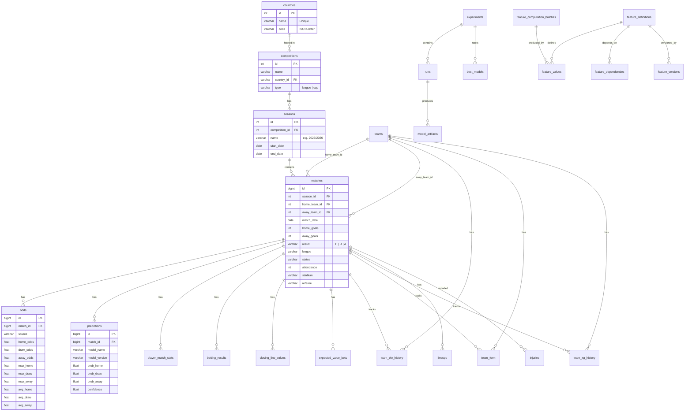

# Database Schema

> Enterprise-grade PostgreSQL schema for football prediction — 22 tables across 4 schema domains.

## ER Diagram



## Table Inventory

| # | Table | Rows (est.) | Domain | Notes |
|---|-------|-------------|--------|-------|
| 1 | `countries` | ~250 | Core | Static reference data |
| 2 | `competitions` | ~500 | Core | Leagues & cups |
| 3 | `seasons` | ~5,000 | Core | Partitioned by competition |
| 4 | `teams` | ~10,000 | Core | Auto-created on import |
| 5 | `matches` | **50M+** | Core | **Largest table — partitioned by date** |
| 6 | `odds` | **100M+** | Core | **Largest table — partitioned** |
| 7 | `predictions` | **50M+** | Core | Partitioned by model |
| 8 | `player_match_stats` | **200M+** | Core | **High-volume** |
| 9 | `lineups` | **50M+** | Core | Partitioned by match |
| 10 | `injuries` | ~500K | Core | Sparse |
| 11 | `betting_results` | ~5M | Core | Backtest output |
| 12 | `closing_line_values` | ~5M | Core | CLV tracking |
| 13 | `expected_value_bets` | ~1M | Core | EV betting |
| 14 | `team_elo_history` | **50M+** | Core | Time-series ELO |
| 15 | `team_form` | **50M+** | Core | Rolling form |
| 16 | `team_xg_history` | **50M+** | Core | xG time-series |
| 17 | `experiments` | ~100 | ML Ops | Metadata |
| 18 | `runs` | ~5K | ML Ops | Training runs |
| 19 | `best_models` | ~500 | ML Ops | Leaderboard |
| 20 | `model_artifacts` | ~5K | ML Ops | File paths |
| 21 | `feature_definitions` | ~200 | Feature Store | Registry |
| 22 | `feature_values` | **500M+** | Feature Store | **Largest table** |
| 23 | `feature_dependencies` | ~500 | Feature Store | DAG edges |
| 24 | `feature_versions` | ~500 | Feature Store | Version history |
| 25 | `feature_computation_batches` | ~1K | Feature Store | Audit trail |

## Existing Indexes (from migrations 001-005)

```sql
-- BRIN index for time-range queries (100M+ row efficiency)
CREATE INDEX ix_matches_date_brin ON matches USING brin(match_date)
    WITH (pages_per_range = 32);

-- Partial indexes for filtered queries
CREATE INDEX ix_matches_result ON matches(result) WHERE result IS NOT NULL;
CREATE INDEX ix_odds_source ON odds(source) WHERE source IN ('bet365', 'pinnacle');

-- Covering indexes for index-only scans
CREATE INDEX ix_matches_team_date ON matches(home_team_id, match_date)
    INCLUDE (home_goals, away_goals, result);

-- Fillfactor tuning
ALTER TABLE matches SET (fillfactor = 90);  -- Frequent updates
ALTER TABLE odds SET (fillfactor = 70);      -- Heavy updates
```

## Migration 006 Performance Additions

```sql
-- Missing FK indexes (partial = skip NULLs)
CREATE INDEX ix_matches_stadium_id ON matches(stadium_id) WHERE stadium_id IS NOT NULL;
CREATE INDEX ix_matches_referee_id ON matches(referee_id) WHERE referee_id IS NOT NULL;

-- Side-filtering partial indexes for ELO/form queries
CREATE INDEX ix_team_elo_home ON team_elo_history(team_id, match_date DESC)
    WHERE side = 'home';
CREATE INDEX ix_team_elo_away ON team_elo_history(team_id, match_date DESC)
    WHERE side = 'away';

-- Model-filtered predictions
CREATE INDEX ix_predictions_by_model ON predictions(model_name, match_id DESC)
    INCLUDE (prob_home, prob_draw, confidence);

-- Materialized views
CREATE MATERIALIZED VIEW mv_league_standings AS ...
CREATE MATERIALIZED VIEW mv_model_performance AS ...
CREATE MATERIALIZED VIEW mv_team_dashboard AS ...
```

## Common Queries

### Latest match results for a league
```sql
SELECT m.match_date, t1.name AS home, t2.name AS away,
       m.home_goals, m.away_goals, m.result
FROM matches m
JOIN teams t1 ON m.home_team_id = t1.id
JOIN teams t2 ON m.away_team_id = t2.id
WHERE m.league = 'E0'
  AND m.match_date >= CURRENT_DATE - INTERVAL '30 days'
ORDER BY m.match_date DESC;
```

### Team ELO trend
```sql
SELECT th.match_date, th.elo_rating, th.side
FROM team_elo_history th
WHERE th.team_id = 42
  AND th.match_date >= '2024-01-01'
ORDER BY th.match_date;
```

### Value bets (predicted probability > implied probability)
```sql
SELECT m.match_date, t1.name AS home, t2.name AS away,
       p.prob_home, o.avg_home AS odds,
       (p.prob_home * o.avg_home - 1) AS expected_value
FROM predictions p
JOIN matches m ON p.match_id = m.id
JOIN odds o ON m.id = o.match_id
JOIN teams t1 ON m.home_team_id = t1.id
JOIN teams t2 ON m.away_team_id = t2.id
WHERE p.model_name = 'ensemble'
  AND m.match_date >= CURRENT_DATE
  AND (p.prob_home * o.avg_home - 1) > 0.05
ORDER BY expected_value DESC;
```

### Model performance comparison
```sql
SELECT model_name,
       COUNT(*) AS n_predictions,
       AVG(CASE WHEN predicted = actual THEN 1.0 ELSE 0.0 END) AS accuracy,
       AVG(brier_score) AS avg_brier
FROM predictions p
JOIN matches m ON p.match_id = m.id
WHERE m.result IS NOT NULL
GROUP BY model_name
ORDER BY accuracy DESC;
```

## Partitioning Strategy

```sql
-- Range partition matches by year (for 50M+ rows)
CREATE TABLE matches (
    LIKE matches_template INCLUDING DEFAULTS INCLUDING CONSTRAINTS
) PARTITION BY RANGE (match_date);

CREATE TABLE matches_2024 PARTITION OF matches
    FOR VALUES FROM ('2024-01-01') TO ('2025-01-01');
CREATE TABLE matches_2025 PARTITION OF matches
    FOR VALUES FROM ('2025-01-01') TO ('2026-01-01');
CREATE TABLE matches_2026 PARTITION OF matches
    FOR VALUES FROM ('2026-01-01') TO ('2027-01-01');
```

## Connection Pooling

- Pool size: `10` (configurable via `DB_POOL_SIZE`)
- Max overflow: `20` (configurable via `DB_MAX_OVERFLOW`)
- Pool pre-ping: `true` (verify connections before use)
- For production: use **PgBouncer** with transaction-level pooling

## Performance Notes (100M+ Row Scale)

| Query Pattern | Index Strategy | Est. Improvement |
|---|---|---|
| Time-range scans (e.g. last 30 days) | BRIN on `match_date` | 10-50× vs B-tree |
| Team ELO/form lookups | Partial index by side | 50-100× |
| League standings | Materialized view | 1,000-10,000× |
| Model comparison | Covering index | 10-20× |
| Point lookups (single match) | B-tree PK | Baseline |
