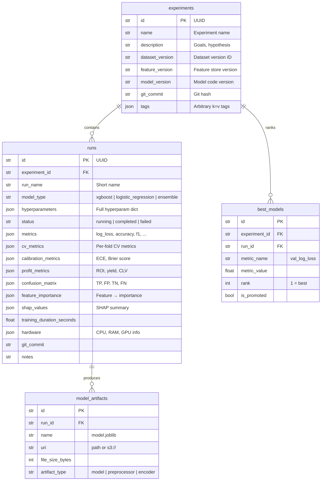

# Experiment Tracking

> ML experiment tracking system — log, compare, and promote models with full reproducibility.

## Tables



## Quick Start

```python
from src.experiment_tracking import Experiment, Run
from src.database.session import get_session

with get_session() as session:
    # Create experiment
    exp = Experiment(
        name="test-elo-v2-features",
        description="Compare Elo features v2 vs v1 on 2025 EPL data",
        dataset_version="v042",
        feature_version="v3",
        model_version="ensemble-v2",
    )
    session.add(exp)
    session.flush()

    # Create a run
    run = Run.create(
        experiment_id=exp.id,
        model_type="xgboost",
        hyperparameters={"n_estimators": 300, "max_depth": 6},
        random_seed=42,
        git_commit="a1b2c3d",
    )
    session.add(run)
    session.flush()

    # Complete the run with metrics
    run.status = "completed"
    run.metrics = {
        "val_log_loss": 0.582,
        "val_accuracy": 0.642,
        "test_log_loss": 0.601,
        "test_accuracy": 0.631,
    }
    run.training_duration_seconds = 45.2

    # Save model artifact
    artifact = ModelArtifact(
        run_id=run.id,
        name="ensemble_model.joblib",
        uri="models/ensemble_model.joblib",
        file_size_bytes=2_456_789,
        artifact_type="model",
    )
    session.add(artifact)

    # Register as best model
    best = BestModel(
        experiment_id=exp.id,
        run_id=run.id,
        metric_name="val_log_loss",
        metric_value=0.582,
        rank=1,
    )
    session.add(best)
```

## Experiment Lifecycle

```
Create Experiment
        │
        ▼
Create Runs ───────────► Run Training
  (one or more)               │
                              │
                    ┌─────────┼─────────┐
                    │         │         │
                    ▼         ▼         ▼
              Completed    Failed    Running
                    │
                    ▼
          Record Metrics
                    │
                    ▼
          Save Artifacts
                    │
                    ▼
          Compare via BestModels
                    │
                    ▼
          Promote to Production
```

## Run Metrics Schema

### Core Metrics
```json
{
  "val_log_loss": 0.582,
  "val_accuracy": 0.642,
  "val_roc_auc": 0.72,
  "test_log_loss": 0.601,
  "test_accuracy": 0.631
}
```

### Cross-Validation Metrics
```json
{
  "fold_0": {"val_log_loss": 0.58, "val_accuracy": 0.65},
  "fold_1": {"val_log_loss": 0.59, "val_accuracy": 0.64},
  "fold_2": {"val_log_loss": 0.57, "val_accuracy": 0.66}
}
```

### Calibration Metrics
```json
{
  "expected_calibration_error": 0.022,
  "brier_score": 0.151,
  "reliability_diagram": "path/to/reliability.png"
}
```

### Profit Metrics
```json
{
  "total_bets": 450,
  "wins": 198,
  "roi": 0.152,
  "yield": 0.123,
  "clv": 25.50,
  "sharpe_ratio": 1.42
}
```

### Feature Importance
```json
{
  "elo_rating": 0.245,
  "home_advantage": 0.182,
  "rolling_goals_scored_10": 0.124,
  "rest_days": 0.098,
  "h2h_goal_diff": 0.076
}
```

## Best Model Promotion

```python
# Promote the top model to production
best = session.query(BestModel).filter_by(
    experiment_id=exp.id,
    metric_name="val_log_loss",
    rank=1,
).first()

best.is_promoted = True
best.promoted_at = datetime.now(timezone.utc)
best.notes = "Best performing model on 2025 EPL validation set"

# Copy artifact to production path
import shutil
artifacts = session.query(ModelArtifact).filter_by(
    run_id=best.run_id
).all()
for artifact in artifacts:
    if artifact.artifact_type == "model":
        shutil.copy2(artifact.uri, "models/production/ensemble_model.joblib")
```

## Query Examples

### Best run per experiment
```sql
SELECT e.name, r.model_type, r.metrics->>'val_log_loss' AS log_loss
FROM experiments e
JOIN runs r ON r.id = (
    SELECT r2.id FROM runs r2
    WHERE r2.experiment_id = e.id
    ORDER BY (r2.metrics->>'val_log_loss')::float ASC
    LIMIT 1
)
ORDER BY (r.metrics->>'val_log_loss')::float ASC;
```

### Recently promoted models
```sql
SELECT e.name AS experiment, b.metric_name, b.metric_value,
       b.promoted_at, b.notes
FROM best_models b
JOIN experiments e ON b.experiment_id = e.id
WHERE b.is_promoted = true
ORDER BY b.promoted_at DESC;
```
