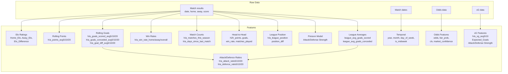

# Feature Documentation

## Overview

| Attribute | Value |
|-----------|-------|
| Total features | 134 |
| Numeric | 132 |
| Non-numeric | 2 (`home_team`, `away_team` — string IDs) |
| NaN cells | 11.1% across the matrix |
| Inf values | 0 |
| Feature groups | 10 |

### Feature Groups Summary

| # | Group | Count | Computation cost | Leakage-safe |
|---|-------|-------|-----------------|--------------|
| 1 | Rolling Team | 30 | Fast (vectorised) | ✅ (`.shift(1)`) |
| 2 | Head-to-Head | 7 | Medium (grouped expanding) | ✅ (`.shift(1)`) |
| 3 | League Position | 7 | Slow (iterative per row) | ✅ (recorded before update) |
| 4 | Elo Ratings | 3 | Fast (sequential) | ✅ (pre-match rating recorded) |
| 5 | Expected Goals (xG) | 15 | Medium (if xG data present) | ✅ (`.shift(1)`) |
| 6 | Poisson Model | 5 | Medium (iterative team-strength) | ✅ (expanding window) |
| 7 | Dixon-Coles | 5 | Expensive | ✅ (fixed — excludes cutoff) |
| 8 | Odds | 18 | Fast (direct) | ✅ (pre-match data) |
| 9 | Attack/Defence Ratios | 12 | Fast (vectorised) | ✅ (fixed — no lookahead) |
| 10 | Temporal | 8 | Fast | ✅ (past-only) |

---

## 1. Rolling Team Features (30 features)

Computed in `_merge_team_stats()` in `src/feature_engineering.py`. For each match, the
home-team stats use the `h_` prefix and the away-team stats use the `a_` prefix.

All rolling computations use `.shift(1)` to ensure the current match's result is
not included in the calculation (no temporal leakage).

### 1.1 Points Averages (6 features)

| Feature | Type | Description | Calculation | Time Window | Data Source | Expected Range |
|---------|------|-------------|-------------|-------------|--------------|----------------|
| `h_points_avg5` | float | Avg points last 5 matches (home) | `.rolling(5).mean().shift(1)` | 5 matches | Match results | 0–3 |
| `h_points_avg10` | float | Avg points last 10 matches (home) | `.rolling(10).mean().shift(1)` | 10 matches | Match results | 0–3 |
| `h_points_avg20` | float | Avg points last 20 matches (home) | `.rolling(20).mean().shift(1)` | 20 matches | Match results | 0–3 |
| `a_points_avg5` | float | Avg points last 5 matches (away) | `.rolling(5).mean().shift(1)` | 5 matches | Match results | 0–3 |
| `a_points_avg10` | float | Avg points last 10 matches (away) | `.rolling(10).mean().shift(1)` | 10 matches | Match results | 0–3 |
| `a_points_avg20` | float | Avg points last 20 matches (away) | `.rolling(20).mean().shift(1)` | 20 matches | Match results | 0–3 |

### 1.2 Goal Averages (12 features)

| Feature | Type | Description | Calculation | Time Window | Data Source | Expected Range |
|---------|------|-------------|-------------|-------------|--------------|----------------|
| `h_goals_scored_avg5` | float | Avg goals scored (home) | `.rolling(5).mean().shift(1)` | 5 matches | Match results | 0–5 |
| `h_goals_scored_avg10` | float | Avg goals scored (home) | `.rolling(10).mean().shift(1)` | 10 matches | Match results | 0–5 |
| `h_goals_scored_avg20` | float | Avg goals scored (home) | `.rolling(20).mean().shift(1)` | 20 matches | Match results | 0–5 |
| `h_goals_conceded_avg5` | float | Avg goals conceded (home) | `.rolling(5).mean().shift(1)` | 5 matches | Match results | 0–5 |
| `h_goals_conceded_avg10` | float | Avg goals conceded (home) | `.rolling(10).mean().shift(1)` | 10 matches | Match results | 0–5 |
| `h_goals_conceded_avg20` | float | Avg goals conceded (home) | `.rolling(20).mean().shift(1)` | 20 matches | Match results | 0–5 |
| `h_goal_diff_avg5` | float | Avg goal diff (home) | `(scored - conceded).rolling(5).mean().shift(1)` | 5 matches | Match results | −5 to +5 |
| `h_goal_diff_avg10` | float | Avg goal diff (home) | `(scored - conceded).rolling(10).mean().shift(1)` | 10 matches | Match results | −5 to +5 |
| `h_goal_diff_avg20` | float | Avg goal diff (home) | `(scored - conceded).rolling(20).mean().shift(1)` | 20 matches | Match results | −5 to +5 |
| `a_goals_scored_avg5` | float | Avg goals scored (away) | `.rolling(5).mean().shift(1)` | 5 matches | Match results | 0–5 |
| `a_goals_scored_avg10` | float | Avg goals scored (away) | `.rolling(10).mean().shift(1)` | 10 matches | Match results | 0–5 |
| `a_goals_scored_avg20` | float | Avg goals scored (away) | `.rolling(20).mean().shift(1)` | 20 matches | Match results | 0–5 |
| `a_goals_conceded_avg5` | float | Avg goals conceded (away) | `.rolling(5).mean().shift(1)` | 5 matches | Match results | 0–5 |
| `a_goals_conceded_avg10` | float | Avg goals conceded (away) | `.rolling(10).mean().shift(1)` | 10 matches | Match results | 0–5 |
| `a_goals_conceded_avg20` | float | Avg goals conceded (away) | `.rolling(20).mean().shift(1)` | 20 matches | Match results | 0–5 |
| `a_goal_diff_avg5` | float | Avg goal diff (away) | `(scored - conceded).rolling(5).mean().shift(1)` | 5 matches | Match results | −5 to +5 |
| `a_goal_diff_avg10` | float | Avg goal diff (away) | `(scored - conceded).rolling(10).mean().shift(1)` | 10 matches | Match results | −5 to +5 |
| `a_goal_diff_avg20` | float | Avg goal diff (away) | `(scored - conceded).rolling(20).mean().shift(1)` | 20 matches | Match results | −5 to +5 |

### 1.3 Win Rates (6 features)

| Feature | Type | Description | Calculation | Time Window | Data Source | Expected Range |
|---------|------|-------------|-------------|-------------|--------------|----------------|
| `h_win_rate_home` | float | Home team win rate at home | `expanding().mean().shift(1)` after filtering home matches | All time | Match results | 0–1 |
| `h_win_rate_away` | float | Home team win rate away | `expanding().mean().shift(1)` after filtering away matches | All time | Match results | 0–1 |
| `h_win_rate_overall` | float | Home team overall win rate | `expanding().mean().shift(1)` | All time | Match results | 0–1 |
| `a_win_rate_home` | float | Away team win rate at home | `expanding().mean().shift(1)` after filtering home matches | All time | Match results | 0–1 |
| `a_win_rate_away` | float | Away team win rate away | `expanding().mean().shift(1)` after filtering away matches | All time | Match results | 0–1 |
| `a_win_rate_overall` | float | Away team overall win rate | `expanding().mean().shift(1)` | All time | Match results | 0–1 |

### 1.4 Match Counts (8 features)

| Feature | Type | Description | Calculation | Time Window | Data Source | Expected Range |
|---------|------|-------------|-------------|-------------|--------------|----------------|
| `h_matches_this_season` | int | Matches played this season (home) | `expanding().count().shift(1)` per season | Season to date | Match results | 0–60 |
| `h_days_since_last_match` | int | Rest days since last match (home) | `date.diff().shift(1)` in days | Last match | Match dates | 0–10000 |
| `h_home_matches` | int | Total home matches (home team) | `expanding().count().shift(1)` on home games | All time | Match results | ≥0 |
| `h_away_matches` | int | Total away matches (home team) | `expanding().count().shift(1)` on away games | All time | Match results | ≥0 |
| `a_matches_this_season` | int | Matches played this season (away) | `expanding().count().shift(1)` per season | Season to date | Match results | 0–60 |
| `a_days_since_last_match` | int | Rest days since last match (away) | `date.diff().shift(1)` in days | Last match | Match dates | 0–10000 |
| `a_home_matches` | int | Total home matches (away team) | `expanding().count().shift(1)` on home games | All time | Match results | ≥0 |
| `a_away_matches` | int | Total away matches (away team) | `expanding().count().shift(1)` on away games | All time | Match results | ≥0 |

**Note:** `days_since_last_match` can be very large (thousands) during between-season
gaps. This is expected and not an error.

---

## 2. Head-to-Head Features (7 features)

Computed in `_compute_h2h_stats()` in `src/feature_engineering.py`. All stats use
an expanding window over past meetings of the same two teams, with `.shift(1)`.

| Feature | Type | Description | Calculation | Time Window | Data Source | Expected Range |
|---------|------|-------------|-------------|-------------|--------------|----------------|
| `h2h_home_points_avg` | float | Avg home points in H2H | `expanding().mean().shift(1)` on points | All past H2H | Match results | 0–3 |
| `h2h_away_points_avg` | float | Avg away points in H2H | `expanding().mean().shift(1)` on points | All past H2H | Match results | 0–3 |
| `h2h_total_goals_avg` | float | Avg total goals in H2H | `(home_goals+away_goals).expanding().mean().shift(1)` | All past H2H | Match results | 0–10 |
| `h2h_home_win_rate` | float | Home win rate in H2H | `expanding().mean().shift(1)` on win indicator | All past H2H | Match results | 0–1 |
| `h2h_home_goals_avg` | float | Avg home goals in H2H | `expanding().mean().shift(1)` on home goals | All past H2H | Match results | 0–10 |
| `h2h_away_goals_avg` | float | Avg away goals in H2H | `expanding().mean().shift(1)` on away goals | All past H2H | Match results | 0–10 |
| `h2h_matches_played` | int | Number of past H2H meetings | `expanding().count().shift(1)` | All past H2H | Match results | 0–100 |

**Data sparsity:** Most team pairs have never played each other in the dataset,
resulting in ~92% NaN for these features. Models must handle NaN gracefully
(XGBoost/LightGBM do natively; sklearn models need imputation).

---

## 3. League Position Features (7 features)

Computed in `_compute_league_positions()` in `src/feature_engineering.py`. Positions
are computed iteratively: points are calculated from past results only (recorded
before the current match's points are added).

| Feature | Type | Description | Calculation | Time Window | Data Source | Expected Range |
|---------|------|-------------|-------------|-------------|--------------|----------------|
| `h_league_position` | int | Home team's league position | Rank by points (desc) before match | Season to date | Match results | 1–80 |
| `h_points_total` | int | Home team's total points | `sum(points).shift(1)` | Season to date | Match results | ≥0 |
| `h_matches_played_league` | int | Home team's matches in league | `count().shift(1)` | Season to date | Match results | 0–60 |
| `a_league_position` | int | Away team's league position | Rank by points (desc) before match | Season to date | Match results | 1–80 |
| `a_points_total` | int | Away team's total points | `sum(points).shift(1)` | Season to date | Match results | ≥0 |
| `a_matches_played_league` | int | Away team's matches in league | `count().shift(1)` | Season to date | Match results | 0–60 |
| `position_diff` | int | `h_league_position - a_league_position` | `h_league_position - a_league_position` | Current | Match results | −79 to +79 |

---

## 4. Elo Ratings (3 features)

Computed in `add_elo_features()` in `src/elo.py`. A standard Elo rating system
with K=32, home advantage bonus, and host-nation bonus for World Cup matches.

| Feature | Type | Description | Calculation | Time Window | Data Source | Expected Range |
|---------|------|-------------|-------------|-------------|--------------|----------------|
| `Home_Elo` | float | Home team's pre-match Elo rating | `prev_rating + K*(actual - expected)` | All time | Match results | 1000–2000 |
| `Away_Elo` | float | Away team's pre-match Elo rating | `prev_rating + K*(actual - expected)` | All time | Match results | 1000–2000 |
| `Elo_Difference` | float | `Home_Elo - Away_Elo` | `Home_Elo - Away_Elo` | Current | Match results | −1000 to +1000 |

**Leakage prevention:** Pre-match ratings are recorded in the feature row **before**
the ratings are updated with the match result.

**Parameters:**
- K-factor: 32
- Home advantage: 100 Elo points
- Host-nation bonus: 50 Elo points (World Cup hosts)
- Regression to mean: 1400 over off-season
- Goal margin: included (up to max 5 goals)

---

## 5. Expected Goals (xG) Features (15 features)

Computed in `_compute_rolling_xg()` in `src/xg_features.py`. Requires xG data
columns (`home_xg`, `away_xg`). If no xG data is available, all features are
zero-filled placeholders.

### 5.1 Rolling xG (6 features)

| Feature | Type | Description | Calculation | Time Window | Data Source | Expected Range |
|---------|------|-------------|-------------|-------------|--------------|----------------|
| `h_xg_avg5` | float | Avg xG for (home, 5-match) | `.rolling(5).mean().shift(1)` on xG | 5 matches | xG data | 0–5 |
| `h_xg_avg10` | float | Avg xG for (home, 10-match) | `.rolling(10).mean().shift(1)` on xG | 10 matches | xG data | 0–5 |
| `h_xga_avg5` | float | Avg xG against (home, 5) | `.rolling(5).mean().shift(1)` on xGA | 5 matches | xG data | 0–5 |
| `h_xga_avg10` | float | Avg xG against (home, 10) | `.rolling(10).mean().shift(1)` on xGA | 10 matches | xG data | 0–5 |
| `h_xgd_avg5` | float | Avg xG diff (home, 5) | `.rolling(5).mean().shift(1)` on xGD | 5 matches | xG data | −5 to +5 |
| `h_xgd_avg10` | float | Avg xG diff (home, 10) | `.rolling(10).mean().shift(1)` on xGD | 10 matches | xG data | −5 to +5 |
| `a_xg_avg5` | float | Avg xG for (away, 5-match) | `.rolling(5).mean().shift(1)` on xG | 5 matches | xG data | 0–5 |
| `a_xg_avg10` | float | Avg xG for (away, 10-match) | `.rolling(10).mean().shift(1)` on xG | 10 matches | xG data | 0–5 |
| `a_xga_avg5` | float | Avg xG against (away, 5) | `.rolling(5).mean().shift(1)` on xGA | 5 matches | xG data | 0–5 |
| `a_xga_avg10` | float | Avg xG against (away, 10) | `.rolling(10).mean().shift(1)` on xGA | 10 matches | xG data | 0–5 |
| `a_xgd_avg5` | float | Avg xG diff (away, 5) | `.rolling(5).mean().shift(1)` on xGD | 5 matches | xG data | −5 to +5 |
| `a_xgd_avg10` | float | Avg xG diff (away, 10) | `.rolling(10).mean().shift(1)` on xGD | 10 matches | xG data | −5 to +5 |

### 5.2 Match-level xG (15 features)

| Feature | Type | Description | Calculation | Data Source | Expected Range |
|---------|------|-------------|-------------|--------------|----------------|
| `home_xg` | float | Raw home xG for the match | Direct column from source | xG data | 0–5 |
| `away_xg` | float | Raw away xG for the match | Direct column from source | xG data | 0–5 |
| `h_xpts` | float | Expected home points from xG | Multinomial from xG probabilities | xG data | 0–3 |
| `a_xpts` | float | Expected away points from xG | Multinomial from xG probabilities | xG data | 0–3 |
| `xgd` | float | `home_xg - away_xg` | `home_xg - away_xg` | Derived | −5 to +5 |
| `Expected_Home_Goals` | float | Poisson-estimated home goals from xG | xG → Poisson λ | xG data | 0–10 |
| `Expected_Away_Goals` | float | Poisson-estimated away goals from xG | xG → Poisson λ | xG data | 0–10 |
| `Expected_Total_Goals` | float | Sum of expected goals | `Expected_Home_Goals + Expected_Away_Goals` | Derived | 0–15 |
| `Expected_Goal_Difference` | float | Diff of expected goals | `Expected_Home_Goals - Expected_Away_Goals` | Derived | −10 to +10 |
| `Home_Attack_Strength` | float | Attack strength vs league avg (xG) | `team_xg_avg / league_xg_avg` | All time (xG) | xG data | 0–6 |
| `Home_Defense_Strength` | float | Defense strength vs league avg (xG) | `team_xga_avg / league_xga_avg` | All time (xG) | xG data | 0–6 |
| `Away_Attack_Strength` | float | Attack strength vs league avg (xG) | `team_xg_avg / league_xg_avg` | All time (xG) | xG data | 0–6 |
| `Away_Defense_Strength` | float | Defense strength vs league avg (xG) | `team_xga_avg / league_xga_avg` | All time (xG) | xG data | 0–6 |
| `competition_importance` | float | Importance weighting | Elo-based or custom weighting | Current | Config | 0–5 |

---

## 6. Poisson Model Features (5 features)

Computed in `add_poisson_features()` in `src/poisson_model.py`. Estimates team
attack/defence strengths using a Poisson model over expanding windows.

| Feature | Type | Description | Calculation | Time Window | Data Source | Expected Range |
|---------|------|-------------|-------------|-------------|--------------|----------------|
| `Home_Attack_Strength` | float | Home attack (goals relative to avg) | `team_goals_scored / league_avg` | Expanding | Match results | 0.5–2.0 |
| `Home_Defense_Strength` | float | Home defense (conceded relative to avg) | `team_goals_conceded / league_avg` | Expanding | Match results | 0.5–2.0 |
| `Away_Attack_Strength` | float | Away attack (goals relative to avg) | `team_goals_scored / league_avg` | Expanding | Match results | 0.5–2.0 |
| `Away_Defense_Strength` | float | Away defense (conceded relative to avg) | `team_goals_conceded / league_avg` | Expanding | Match results | 0.5–2.0 |

**Note:** These are distinct from the xG attack/defence strengths. The Poisson
versions use actual goals scored/conceded; the xG versions use expected goals.

---

## 7. Odds Features (18 features)

Computed in `add_odds_features()` in `src/odds_processing.py`. Requires bookmaker
odds columns (e.g. `B365H`, `B365D`, `B365A`, `BbAvH`, `BbAvD`, `BbAvA`).
Zero-filled placeholders when no odds data exists.

### 7.1 Raw Odds (6 features)

| Feature | Type | Description | Calculation | Data Source | Expected Range |
|---------|------|-------------|-------------|--------------|----------------|
| `odds_home_opening` | float | Opening home win odds | Direct column | Bookmaker odds | ≥0 |
| `odds_home_closing` | float | Closing home win odds | Direct column | Bookmaker odds | ≥0 |
| `odds_draw_opening` | float | Opening draw odds | Direct column | Bookmaker odds | ≥0 |
| `odds_draw_closing` | float | Closing draw odds | Direct column | Bookmaker odds | ≥0 |
| `odds_away_opening` | float | Opening away win odds | Direct column | Bookmaker odds | ≥0 |
| `odds_away_closing` | float | Closing away win odds | Direct column | Bookmaker odds | ≥0 |

### 7.2 Fair Probabilities (6 features)

| Feature | Type | Description | Calculation | Data Source | Expected Range |
|---------|------|-------------|-------------|--------------|----------------|
| `fair_prob_home_opening` | float | No-margin home prob (opening) | `(1/odds) / sum(1/odds_all)` | Derived from odds | 0–1 |
| `fair_prob_home_closing` | float | No-margin home prob (closing) | `(1/odds) / sum(1/odds_all)` | Derived from odds | 0–1 |
| `fair_prob_draw_opening` | float | No-margin draw prob (opening) | `(1/odds) / sum(1/odds_all)` | Derived from odds | 0–1 |
| `fair_prob_draw_closing` | float | No-margin draw prob (closing) | `(1/odds) / sum(1/odds_all)` | Derived from odds | 0–1 |
| `fair_prob_away_opening` | float | No-margin away prob (opening) | `(1/odds) / sum(1/odds_all)` | Derived from odds | 0–1 |
| `fair_prob_away_closing` | float | No-margin away prob (closing) | `(1/odds) / sum(1/odds_all)` | Derived from odds | 0–1 |

### 7.3 Derived Odds Features (6 features)

| Feature | Type | Description | Calculation | Data Source | Expected Range |
|---------|------|-------------|-------------|--------------|----------------|
| `odds_movement_home` | float | Absolute odds movement | `closing - opening` | Derived | −100 to +100 |
| `odds_movement_draw` | float | Absolute odds movement | `closing - opening` | Derived | −100 to +100 |
| `odds_movement_away` | float | Absolute odds movement | `closing - opening` | Derived | −100 to +100 |
| `odds_movement_pct_home` | float | % odds movement | `(closing-opening)/opening*100` | Derived | −100 to +100 |
| `odds_movement_pct_draw` | float | % odds movement | `(closing-opening)/opening*100` | Derived | −100 to +100 |
| `odds_movement_pct_away` | float | % odds movement | `(closing-opening)/opening*100` | Derived | −100 to +100 |
| `clv_home` | float | Closing line value | `fair_prob_closing - fair_prob_opening` | Derived | −1 to +1 |
| `clv_draw` | float | Closing line value | `fair_prob_closing - fair_prob_opening` | Derived | −1 to +1 |
| `clv_away` | float | Closing line value | `fair_prob_closing - fair_prob_opening` | Derived | −1 to +1 |
| `market_confidence` | float | Market efficiency | `1 / (1 + margin)` | Derived | 0–1 |
| `bookmaker_margin_opening` | float | Opening bookmaker margin | `sum(1/odds_all) - 1` | Derived | 0–1 |
| `bookmaker_margin_closing` | float | Closing bookmaker margin | `sum(1/odds_all) - 1` | Derived | 0–1 |

---

## 8. Attack/Defence Ratios (12 features)

Computed in `_add_attack_defence_ratios()` in `src/feature_engineering.py`.
These are **team rolling average divided by league-wide rolling average**.

| Feature | Type | Description | Calculation | Time Window | Data Source | Expected Range |
|---------|------|-------------|-------------|-------------|--------------|----------------|
| `h_attack_ratio5` | float | Home attack / league avg | `team_goals_scored_avg / league_avg` | 5 matches | Match results | 0–10 |
| `h_attack_ratio10` | float | Home attack / league avg | `team_goals_scored_avg / league_avg` | 10 matches | Match results | 0–10 |
| `h_attack_ratio20` | float | Home attack / league avg | `team_goals_scored_avg / league_avg` | 20 matches | Match results | 0–10 |
| `h_defence_ratio5` | float | Home defence / league avg | `team_goals_conceded_avg / league_avg` | 5 matches | Match results | 0–10 |
| `h_defence_ratio10` | float | Home defence / league avg | `team_goals_conceded_avg / league_avg` | 10 matches | Match results | 0–10 |
| `h_defence_ratio20` | float | Home defence / league avg | `team_goals_conceded_avg / league_avg` | 20 matches | Match results | 0–10 |
| `a_attack_ratio5` | float | Away attack / league avg | `team_goals_scored_avg / league_avg` | 5 matches | Match results | 0–10 |
| `a_attack_ratio10` | float | Away attack / league avg | `team_goals_scored_avg / league_avg` | 10 matches | Match results | 0–10 |
| `a_attack_ratio20` | float | Away attack / league avg | `team_goals_scored_avg / league_avg` | 20 matches | Match results | 0–10 |
| `a_defence_ratio5` | float | Away defence / league avg | `team_goals_conceded_avg / league_avg` | 5 matches | Match results | 0–10 |
| `a_defence_ratio10` | float | Away defence / league avg | `team_goals_conceded_avg / league_avg` | 10 matches | Match results | 0–10 |
| `a_defence_ratio20` | float | Away defence / league avg | `team_goals_conceded_avg / league_avg` | 20 matches | Match results | 0–10 |

**League average** (`league_avg_goals_scored`, `league_avg_goals_conceded`) is
computed using an expanding window with `.shift(1)` — no lookahead bias.

---

## 9. Temporal Features (8 features)

Extracted from the `date` column in `src/preprocessing.py`.

| Feature | Type | Description | Calculation | Data Source | Expected Range |
|---------|------|-------------|-------------|--------------|----------------|
| `home_goals_ht` | float | Half-time home goals | Direct column | Match results | ≥0 |
| `away_goals_ht` | float | Half-time away goals | Direct column | Match results | ≥0 |
| `year` | int | Calendar year | `date.dt.year` | Match dates | 2002–2026 |
| `month` | int | Calendar month | `date.dt.month` | Match dates | 1–12 |
| `day_of_week` | int | Day of week (0=Mon, 6=Sun) | `date.dt.dayofweek` | Match dates | 0–6 |
| `day_of_year` | int | Day of year | `date.dt.dayofyear` | Match dates | 1–366 |
| `week_of_season` | int | Week since Aug 1st | `(date - Aug1).dt.days // 7` | Match dates | 1–60 |
| `is_midweek` | int | Tue/Wed/Thu indicator | `day_of_week in {1,2,3}` | Derived | 0–1 |

---

## 10. Dixon-Coles Features (5 features — not active by default)

Computed in `src/dixon_coles.py`. The Dixon-Coles model extends the Poisson model
with a low-scoring correlation parameter (ρ) to better handle draws. Not currently
enabled in the default pipeline (requires adding DC columns to `build_features()`).

| Feature | Type | Description | Calculation | Time Window | Data Source | Expected Range |
|---------|------|-------------|-------------|-------------|--------------|----------------|
| `DC_Home_Win_Prob` | float | Home win probability from DC | DC `P(X>Y)` | Expanding | Match results | 0–1 |
| `DC_Draw_Prob` | float | Draw probability from DC | DC `P(X=Y)` | Expanding | Match results | 0–1 |
| `DC_Away_Win_Prob` | float | Away win probability from DC | DC `P(X<Y)` | Expanding | Match results | 0–1 |
| `DC_Expected_Home_Goals` | float | Expected home goals (DC) | DC attack × defence × ρ | Expanding | Match results | 0–5 |
| `DC_Expected_Away_Goals` | float | Expected away goals (DC) | DC attack × defence × ρ | Expanding | Match results | 0–5 |

---

## Feature Dependencies

### Computation Order

1. **Temporal** — no dependencies (raw dates only)
2. **Elo** — sequential (each match depends on previous ratings)
3. **Rolling stats** — grouped by team, chronological expanding window
4. **H2H** — grouped by team pair, chronological expanding window
5. **League position** — iterative (points table updated per match)
6. **Odds** — no dependencies on other features
7. **xG** — rolling on xG data (if available)
8. **Poisson** — team strength from expanding goal window
9. **League averages** — computed before attack/defence ratios
10. **Attack/Defence ratios** — depends on rolling goals + league averages

---

## Usage Notes

### NaN Handling
- **Sklearn models** (LR, RF): Impute with `X.fillna(X.mean())` or `SimpleImputer`.
  The `train_model()` function does this automatically using training column means.
- **XGBoost / LightGBM**: Handle NaN natively — no imputation needed.

### Feature Selection
- The top-10 most important features (by logistic regression absolute coefficient)
  are typically rolling averages, Elo difference, and attack ratios.
- H2H features are too sparse (~92% NaN) to be useful for small datasets but become
  valuable as the dataset grows (more repeated fixtures between the same teams).
- Odds features are zero-filled placeholders when no odds data is available. They
  are safe to include (no signal) but waste model capacity.

### Leakage Prevention
All features are computed using only data available **before** the match:
- Rolling stats: `.shift(1)` applied to all `.rolling()` / `.expanding()` calls
- Elo: pre-match rating recorded, post-match rating stored separately
- League position: points recorded before match result is processed
- H2H: `.shift(1)` on expanding meetings
- Dixon-Coles: refit cutoff excludes current match (fixed in audit)
- Attack/defence ratios: league avg uses expanding window with `.shift(1)` (fixed in audit)

### Validation
Run `python scripts/validate_features.py` to check all features against expected
ranges, NaN tolerances, and distributional assumptions. The script produces a
structured JSON report at `reports/feature_validation.json`.
