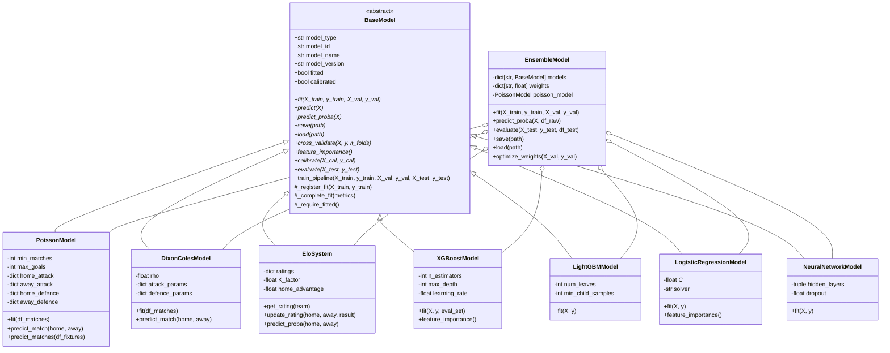
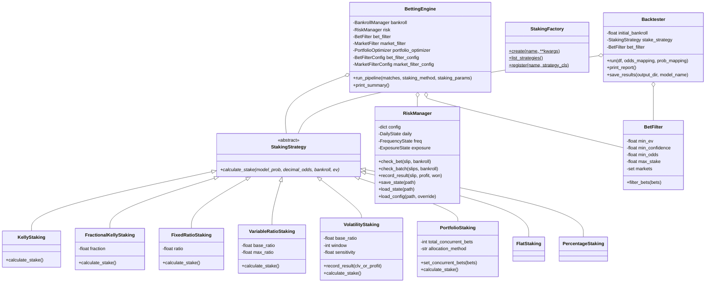
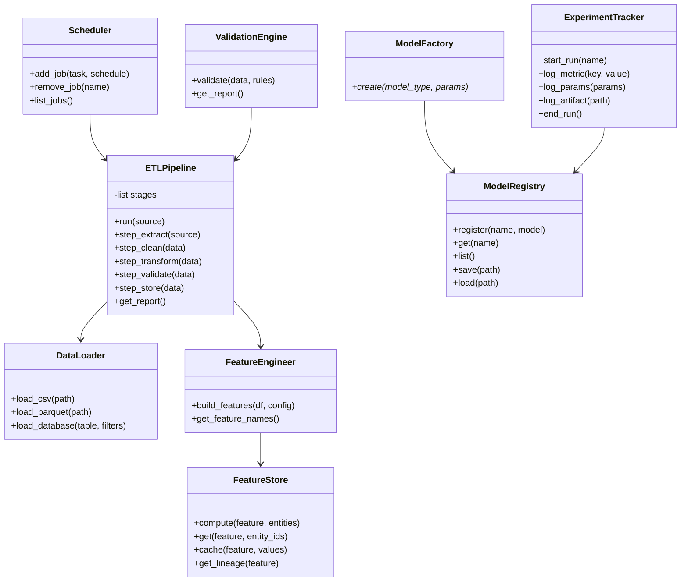
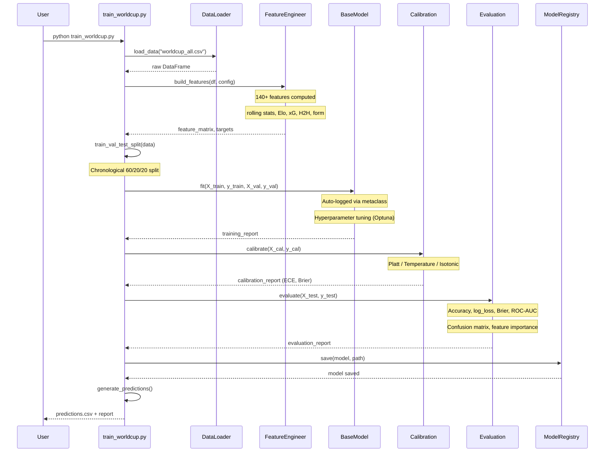
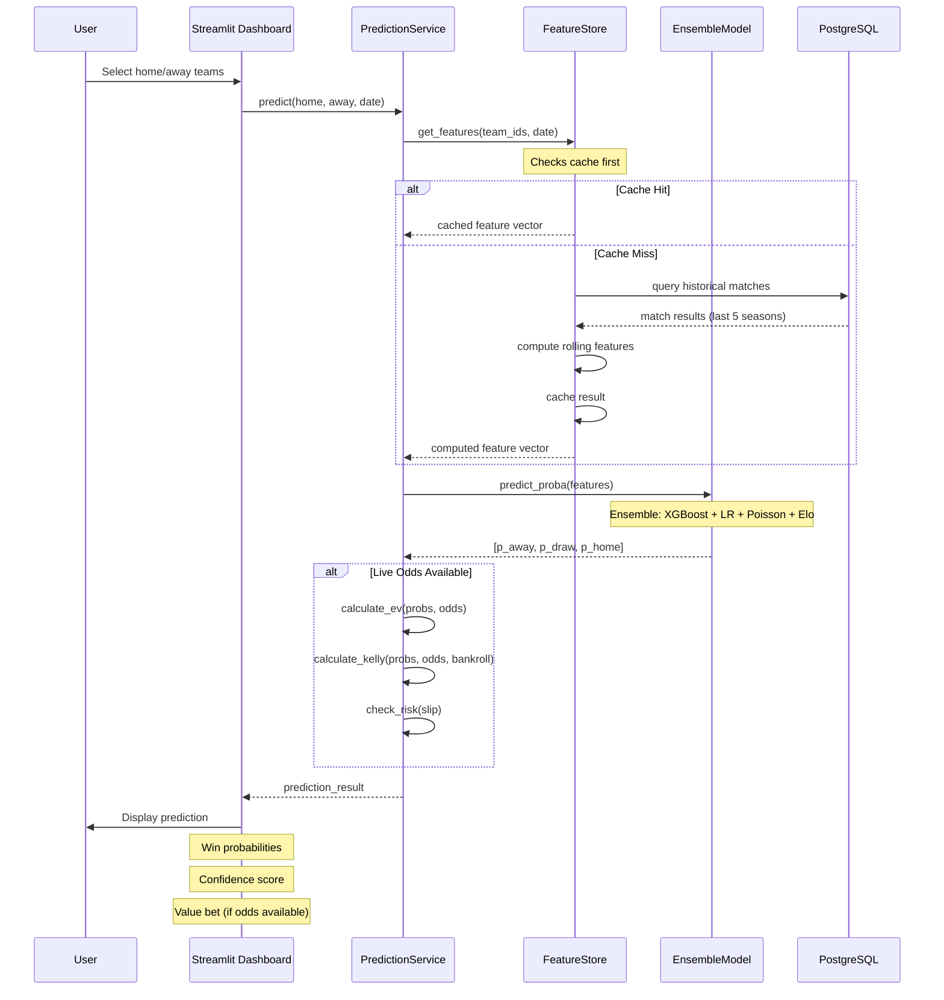
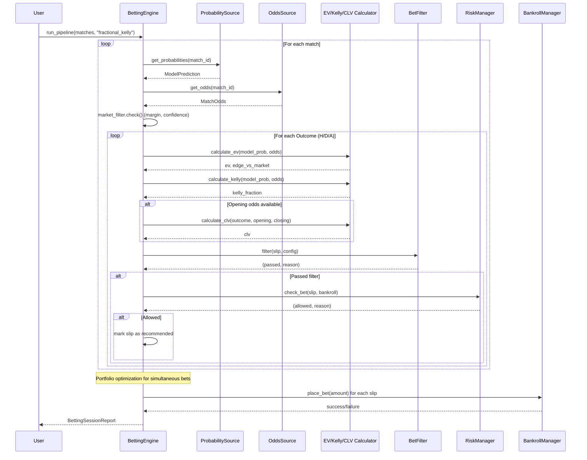
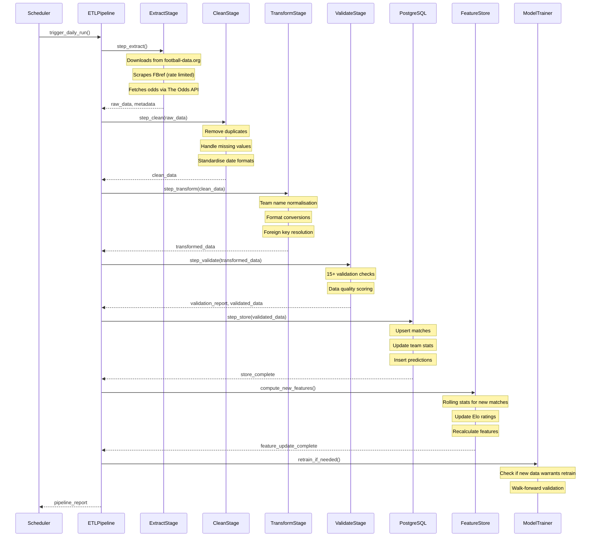

# Software Architecture — Football Prediction System

> **Version:** 2.0  
> **Last Updated:** July 2026  
> **Status:** Production Ready

---

## Table of Contents

1. [Architecture Overview](#1-architecture-overview)
2. [Technology Stack](#2-technology-stack)
3. [Layer Architecture](#3-layer-architecture)
4. [Module Architecture](#4-module-architecture)
5. [Class Diagrams](#5-class-diagrams)
6. [Sequence Diagrams](#6-sequence-diagrams)
7. [Data Flow Diagrams](#7-data-flow-diagrams)
8. [Component Interaction](#8-component-interaction)
9. [Deployment Architecture](#9-deployment-architecture)
10. [Architecture Decisions](#10-architecture-decisions)
11. [SOLID Compliance](#11-solid-compliance)

---

## 1. Architecture Overview

The system follows a **layered architecture** with four primary layers plus an external integrations layer. Each layer has well-defined responsibilities and communicates through dependency injection and protocol-based interfaces.

```
                    ┌─────────────────────────────────────────────────────────┐
                    │                   PRESENTATION LAYER                     │
                    │  ┌──────────────┐  ┌──────────────┐  ┌───────────────┐ │
                    │  │  Streamlit   │  │  CLI Tools   │  │   REST API    │ │
                    │  │  Dashboard   │  │  (35+ pkgs)  │  │  (FastAPI)    │ │
                    │  └──────┬───────┘  └──────┬───────┘  └───────┬───────┘ │
                    └─────────┼──────────────────┼──────────────────┼─────────┘
                              │                  │                  │
                    ┌─────────▼──────────────────▼──────────────────▼─────────┐
                    │                     SERVICE LAYER                        │
                    │  ┌────────────────┐  ┌────────────────┐                 │
                    │  │  Prediction    │  │  Training      │                 │
                    │  │  Service       │  │  Service       │                 │
                    │  ├────────────────┤  ├────────────────┤                 │
                    │  │  Betting       │  │  Backtesting   │                 │
                    │  │  Engine        │  │  Engine        │                 │
                    │  ├────────────────┤  ├────────────────┤                 │
                    │  │  Value Betting │  │  Experiment    │                 │
                    │  │  Calculator    │  │  Tracker       │                 │
                    │  └───────┬────────┘  └───────┬────────┘                 │
                    └──────────┼───────────────────┼──────────────────────────┘
                               │                   │
                    ┌──────────▼───────────────────▼──────────────────────────┐
                    │                    DOMAIN LAYER                          │
                    │  ┌──────────┐  ┌──────────┐  ┌──────────────────────┐  │
                    │  │ Ensemble │  │ Poisson  │  │ Feature Engineering  │  │
                    │  │ Model    │  │ Model    │  │ (140+ features)      │  │
                    │  ├──────────┤  ├──────────┤  ├──────────────────────┤  │
                    │  │ XGBoost  │  │ LightGBM │  │ Elo Rating          │  │
                    │  │          │  │          │  │ System              │  │
                    │  ├──────────┤  ├──────────┤  ├──────────────────────┤  │
                    │  │ Logistic │  │ Neural   │  │ Dixon-Coles         │  │
                    │  │ Regressn │  │ Network  │  │ Model               │  │
                    │  └──────────┘  └──────────┘  └──────────────────────┘  │
                    └────────────────────────────────────────────────────────┘
                                        │
                    ┌───────────────────▼────────────────────────────────────┐
                    │               DATA / INFRASTRUCTURE LAYER               │
                    │  ┌───────────┐  ┌──────────┐  ┌────────────────────┐  │
                    │  │ PostgreSQL│  │ ETL      │  │ Data Versioning    │  │
                    │  │ (22 tbls) │  │ Pipeline │  │ (Parquet)          │  │
                    │  ├───────────┤  ├──────────┤  ├────────────────────┤  │
                    │  │ Feature   │  │ Cache    │  │ Validation         │  │
                    │  │ Store     │  │ Manager  │  │ Engine             │  │
                    │  ├───────────┤  ├──────────┤  ├────────────────────┤  │
                    │  │ Scheduler │  │ Monitoring│  │ Experiment        │  │
                    │  │ (cron/Win)│  │ System   │  │ Tracking (DB)     │  │
                    │  └───────────┘  └──────────┘  └────────────────────┘  │
                    └────────────────────────────────────────────────────────┘
                                        │
                    ┌───────────────────▼────────────────────────────────────┐
                    │             EXTERNAL INTEGRATIONS                       │
                    │  ┌────────────┐  ┌────────────┐  ┌─────────────────┐  │
                    │  │ Football-  │  │ The Odds   │  │ Transfermarkt   │  │
                    │  │ Data.org   │  │ API        │  │                 │  │
                    │  ├────────────┤  ├────────────┤  ├─────────────────┤  │
                    │  │ FBref      │  │ Understat  │  │ MLflow  │WandB  │  │
                    │  │ Scraper    │  │ (xG Data)  │  │ TensorBoard     │  │
                    │  └────────────┘  └────────────┘  └─────────────────┘  │
                    └────────────────────────────────────────────────────────┘
```

---

## 2. Technology Stack

### 2.1 Core Stack

| Component | Technology | Version | Purpose |
|-----------|-----------|---------|---------|
| **Language** | Python | 3.12+ | Primary development language |
| **ML Framework** | scikit-learn | 1.9+ | Base model API, metrics, calibration |
| **Gradient Boosting** | XGBoost | 2.x | Primary ML model |
| **Gradient Boosting** | LightGBM | 4.x | Secondary ML model |
| **Neural Networks** | PyTorch | 2.x | Neural network model |
| **Numerical** | NumPy | 2.x | Array computations |
| **DataFrame** | Pandas | 3.x | Data manipulation |
| **Visualization** | Matplotlib / Plotly | Latest | Charts and reports |
| **Dashboard** | Streamlit | Latest | Interactive dashboard |
| **Database** | PostgreSQL | 16+ | Persistent storage |
| **ORM** | SQLAlchemy | 2.x | Database ORM |
| **Migrations** | Alembic | Latest | Schema migrations |
| **API** | FastAPI | Latest | REST API endpoints |
| **Scheduling** | cron / Windows Task Scheduler | — | Task scheduling |

### 2.2 Supporting Libraries

| Library | Purpose |
|---------|---------|
| **pydantic** | Configuration and data validation |
| **PyYAML** | YAML config file parsing |
| **joblib** | Model serialization |
| **beautifulsoup4** | HTML parsing (FBref) |
| **requests / aiohttp** | HTTP clients for external APIs |
| **pytest** | Testing framework |
| **black / ruff** | Code formatting and linting |

### 2.3 External Data Sources

| Source | Data Type | Access Method |
|--------|-----------|---------------|
| **Football-Data.org** | Match results, league tables | REST API |
| **The Odds API** | Live betting odds | REST API |
| **Transfermarkt** | Player data, squad info, market values | Web scraping |
| **FBref** | Advanced match statistics (xG, xAG) | Web scraping |
| **Understat** | Expected goals (xG) data | JSON API |
| **World Cup API (custom)** | Tournament data, standings | REST + scraping |

---

## 3. Layer Architecture

### 3.1 Presentation Layer

> **Desktop Application:** A native desktop application is not part of this architecture. The system provides a **web-based dashboard** (Streamlit) and a comprehensive **CLI toolkit** (35+ scripts). All functionality is accessible through either the browser (via the Streamlit dashboard) or terminal (via Python scripts). No native desktop app is required.

#### Streamlit Dashboard (`src/app/`)

```
src/app/
  dashboard.py          # Main page — overview metrics
  pages/
    1_Predict.py        # Match prediction interface
    2_Value_Bets.py     # Value betting dashboard
    3_Backtest.py       # Backtest results viewer
    4_WorldCup.py       # World Cup 2026 tournament page
  utils.py              # Shared UI helpers, data loading
```

The dashboard provides:
- **Home**: Key metrics (matches, teams, model info, latest data)
- **Predict**: Team selector → instant match outcome prediction
- **Value Bets**: Live odds → Kelly stake → value bet recommendations
- **Backtest**: Historical performance metrics, equity curves
- **World Cup**: Bracket tree, probability bars, confidence analysis

#### CLI Tools (`scripts/`)

35+ command-line scripts organized by function:

| Category | Scripts |
|----------|---------|
| **Training** | `train_worldcup.py`, `train_league.py`, `train_xgboost.py` |
| **Data Collection** | `collect_all_worldcups.py`, `collect_leagues.py`, `collect_player_data.py` |
| **Backtesting** | `backtest_all_models.py`, `run_backtest.py` |
| **Reporting** | `generate_backtest_report.py`, `generate_clv_report.py`, `generate_bankroll_report.py` |
| **Optimization** | `optimize_bankroll.py`, `tune_all_models.py`, `compute_ensemble_weights.py` |
| **Value Betting** | `today_value_bets_live.py`, `find_value_bets.py` |
| **Pipeline** | `run_pipeline.py`, `run_combined_pipeline.py`, `refresh_worldcup.py` |

#### REST API (FastAPI)

FastAPI-based endpoints for experiment tracking, model management, and inference.

**Endpoints:**

| Method | Endpoint | Description | Request Body | Response |
|--------|----------|-------------|--------------|----------|
| `GET` | `/api/v1/models` | List all registered models | — | `[{model_id, name, type, version, status}]` |
| `GET` | `/api/v1/models/{id}` | Get model details | — | `{model_id, name, type, ...}` |
| `POST` | `/api/v1/models` | Register a new model | `{name, type, version, path}` | `{model_id, status: "created"}` |
| `DELETE` | `/api/v1/models/{id}` | Delete a model | — | `{status: "deleted"}` |
| `GET` | `/api/v1/experiments` | List experiments | — | `[{experiment_id, name, status}]` |
| `POST` | `/api/v1/experiments` | Create experiment | `{name, params}` | `{experiment_id}` |
| `POST` | `/api/v1/experiments/{id}/metrics` | Log metrics | `{metrics: {key: value}}` | `{status: "logged"}` |
| `POST` | `/api/v1/predict` | Run model inference | `{home_team, away_team, date}` | `{prob_home, prob_draw, prob_away, confidence}` |

**Authentication:** API keys via `X-API-Key` header
**Rate Limiting:** 100 req/min per key
**Response Format:** JSON, all timestamps in ISO 8601 UTC

### 3.2 Service Layer

| Service | File | Responsibility |
|---------|------|----------------|
| **PredictionService** | `src/services/prediction_service.py` | Orchestrates model inference, feature transformation, probability output |
| **TrainingService** | `src/services/training_service.py` | Manages model training lifecycle, hyperparameter tuning |
| **BettingEngine** | `src/betting/engine.py` | Orchestrates full betting pipeline: odds → filters → calculators → staking → risk → bankroll |
| **BacktestEngine** | `src/backtesting/__init__.py` | Historical simulation of betting strategies |
| **ValueBetting** | `src/value_betting.py` | EV computation, Kelly stakes, value opportunity identification |
| **ExperimentTracker** | `src/experiment_tracking/` | Records experiment metadata, metrics, artifacts |

### 3.3 Domain Layer

#### Model Architecture (`src/models/`)

```
src/models/
  base.py           # BaseModel (ABC) with metaclass auto-logging
  factory.py        # ModelFactory — creation by name
  registry.py       # ModelRegistry — discovery and plugin system
  serialization.py  # ModelSerializer — save/load abstraction
  plugins.py        # Plugin system for auto-registering models
  decorators.py     # Input validation decorators
```

**BaseModel** abstract interface (10 methods to implement):

```
BaseModel
├── fit(X_train, y_train, ...)
├── predict(X) → np.ndarray
├── predict_proba(X) → np.ndarray
├── save(path) → str
├── load(path) → BaseModel (classmethod)
├── cross_validate(X, y, n_folds)
├── feature_importance() → dict
├── calibrate(X_cal, y_cal)
├── evaluate(X_test, y_test)
└── train_pipeline(...) → dict (template method)
```

**Concrete Models:**

| Model | File | Type | Key Characteristics |
|-------|------|------|---------------------|
| **XGBoost** | `src/train.py` | Gradient Boosting | Primary model, best standalone Brier (0.5824) |
| **LightGBM** | `scripts/train_lightgbm.py` | Gradient Boosting | Faster training, competitive accuracy |
| **RandomForest** | `scripts/train_random_forest.py` | Ensemble | Robust to overfitting |
| **LogisticRegression** | `scripts/train_logistic_regression.py` | Linear | Interpretable baseline |
| **NeuralNetwork** | `scripts/train_neural_network.py` | Deep Learning | PyTorch-based, 3 hidden layers |
| **PoissonModel** | `src/poisson_model.py` | Statistical | Goal-based generative model |
| **DixonColesModel** | `src/dixon_coles.py` | Statistical | Attack/defence strength parameters |
| **EloSystem** | `src/elo.py` | Rating System | Elo ratings with xG-margin K-factor |
| **EnsembleModel** | `src/ensemble.py` | Weighted Average | Combines all models, best overall |

#### Feature Engineering (`src/feature_engineering.py`)

Produces 140+ features across categories:
- **Rolling stats** — recent form, goals scored/conceded (5/10/15 match windows)
- **Head-to-head** — historical matchup results
- **Elo ratings** — team strength differentials
- **xG features** — expected goals rolling averages
- **League position** — table standings
- **Home/away splits** — home advantage metrics
- **Discipline** — cards, fouls
- **Schedule** — days since last match, match density

### 3.4 Data / Infrastructure Layer

```
src/
  database/             # PostgreSQL ORM (22 tables)
    models/             # SQLAlchemy model definitions
    repositories/       # CRUD abstraction layer
    session.py          # Connection management
    base.py             # Declarative base
  etl/                  # 6-stage ETL pipeline
  data_collection/      # External data source integrations
  data_versioning/      # Immutable Parquet snapshots
  feature_store/        # Feature computation + caching
  scheduler/            # Cross-platform task scheduler
  monitoring/           # System + data quality metrics
  validation/           # Rule-based validation engine
  cache/                # In-memory caching layer
```

**Database Schema** (22 tables):

```
Teams ──── Matches ──── Predictions
  │                     │
  ├── TeamEloHistory    ├── BettingResults
  ├── TeamForm          ├── ExpectedValueBets
  ├── TeamXGHistory     ├── ClosingLineValues
  └── Transfers         └── ClosingOdds
  
Players ──── PlayerMatchStats
  │             │
  ├── Injuries  └── Lineups
  └── Transfers
  
Competitions ──── Seasons
Countries ──────── Referees ──── Stadiums ──── Weather
```

### 3.5 External Integrations Layer

```
src/data_collection/
  sources/
    football_data_co_uk.py    # League match results API
    football_data_org.py      # Alternative results source
    worldcup.py               # World Cup tournament data
    transfermarkt.py          # Squad info, market values
    transfermarkt_lineups.py  # Lineup data
    fbref/                    # Scraped match statistics
      client.py               # HTTP client with rate limiting
      parser.py               # HTML table parser
      robots.py               # Robots.txt compliance
      models.py               # Data models
    understat/                 # xG data API
      client.py               # JSON API client
      parser.py               # xG data parser
      models.py               # xG data models
      importer.py             # Database import
```

---

## 4. Module Architecture

### 4.1 Betting Framework (`src/betting/`)

The betting framework is a modular, protocol-based system:

```
src/betting/
  base.py             # Protocols/interfaces for all components
  models.py           # Data classes: BetSlip, Bankroll, MatchOdds, etc.
  engine.py           # BettingEngine — orchestrates the pipeline
  ev.py               # Expected Value calculation
  kelly.py            # Kelly Criterion stake sizing
  calculator.py       # Calculator factory (EV, Kelly, CLV calculators)
  staking.py          # Stake sizing strategies (8 strategies)
  filtering.py        # BetFilter — configurable bet gating
  risk_management.py  # RiskManager — comprehensive risk limits
  backtest.py         # Backtesting engine
  clv.py              # Closing Line Value calculations
  api.py              # Public API exports
  factory.py          # EngineFactory — dependency injection
  registry.py         # Plugin registry
  decorators.py       # Method decorators
  cli.py              # CLI interface
  plugins.py          # Plugin system
```

**Betting Pipeline** (in `BettingEngine.run_pipeline()`):

```
Probability Source → Odds Source → Market Filter → EV/Kelly/CLV Calculators
→ Bet Filter → Portfolio Optimizer → Risk Manager → Bankroll Manager
```

### 4.2 Stake Sizing Strategies

All implement `StakingStrategy` abstract base:

| Strategy | Formula | Category |
|----------|---------|----------|
| **FlatStaking** | `fixed_amount` | Fixed |
| **PercentageStaking** | `pct × bankroll` | Percentage |
| **FixedRatioStaking** | `ratio × bankroll` | Ratio |
| **VariableRatioStaking** | `ratio × (1 + EV) × bankroll` | Dynamic |
| **VolatilityStaking** | `ratio × vol_factor × bankroll` | Dynamic |
| **PortfolioStaking** | `bankroll / n_bets` (weighted optional) | Portfolio |
| **KellyStaking** | `(p×odds − 1) / (odds − 1)` | Kelly |
| **FractionalKellyStaking** | `kelly × fraction` | Kelly |

### 4.3 Risk Management Limits

All enforced by `RiskManager`:

| Category | Limits |
|----------|--------|
| **Daily Loss** | `max_loss_pct`, `max_loss_absolute`, `reset_at_midnight` |
| **Drawdown** | `max_drawdown_pct`, `cooldown_on_breach` |
| **Consecutive Losses** | `max_consecutive`, `cooldown_bets` |
| **Frequency** | `max_per_hour`, `max_per_day`, `max_per_week` |
| **Stake** | `max_single_pct`, `min_odds`, `max_odds` |
| **Diversification** | `max_per_league`, `max_per_team`, `excluded_leagues` |
| **Exposure** | `max_open_bets`, `max_open_bets_per_match` |

### 4.4 Backtesting Framework (`src/backtesting/`)

```
src/backtesting/
  backtester.py     # Backtester class — multi-market simulation
  clv.py            # CLV calculation utilities
  metrics.py        # Performance metric computation
  __init__.py       # BacktestEngine, BacktestMetrics, run_backtest()
```

Key features:
- Chronological walk-forward simulation
- Multi-market support (1X2, BTTS, Over/Under)
- Push/void bet handling
- Pluggable staking and filtering
- Comprehensive metrics (Sharpe, Sortino, Profit Factor, CLV, streaks)

### 4.5 Feature Framework (`src/feature_framework/`)

```
src/feature_framework/
  base.py             # FeaturePipelineABC — abstract pipeline definition
  pipeline.py         # FeaturePipeline — concrete implementation
  orchestrator.py     # Multi-pipeline orchestration
  orchestrator_cli.py # CLI for the orchestrator
  config.py           # Configuration management
  models.py           # PipelineReport, feature metadata
  exceptions.py       # Custom exceptions (6 types)
  decorators.py       # Feature computation decorators
  plugins.py          # Plugin registration
  parallel.py         # Parallel computation support
  league_strength.py  # LeagueStrengthEngine
  features/
    elo_rating.py     # EloEngine — feature computation
    team_form.py      # Form feature computation
    h2h.py            # Head-to-head feature computation
    betting_market.py # Market feature computation
    schedule.py       # Schedule feature computation
  validation/
    checks.py         # Validation checks (4 types)
    report.py         # Validation report generation
```

---

## 5. Class Diagrams

### 5.1 Core Model Hierarchy



### 5.2 Betting Framework Class Diagram



### 5.3 Data Layer Class Diagram



---

## 6. Sequence Diagrams

### 6.1 Full Training Pipeline



### 6.2 Live Prediction Flow



### 6.3 Betting Pipeline



### 6.4 ETL Data Import



---

## 7. Data Flow Diagrams

### 7.1 Top-Level Data Flow

```
External Sources                     Internal Processing                    Outputs
─────────────────                    ────────────────────                   ───────

Football-Data.org ─┐
                   ├──→ ETL Pipeline ──→ PostgreSQL ──→ Feature Store ──→ Model Training ──→ Predictions
The Odds API ──────┤                    │                                    │
                   │                    ├──→ Data Versioning (Parquet)        ├──→ Backtest Results
Transfermarkt ─────┤                    │                                    │
                   │                    ├──→ Monitoring Metrics               ├──→ Value Bets
FBref ─────────────┤                    │                                    │
                   │                    └──→ Validation Reports              ├──→ CLV Analysis
Understat ─────────┘                                                         │
                                                                             └──→ Dashboard
```

### 7.2 Training Data Flow

```
Raw Data ──→ Feature Engineering ──→ Train/Val/Test Split ──→ Model Training
  │                                    │                            │
  │                                    │ (chronological)            ├──→ XGBoost
  ├──→ clean_csv()                     │                            ├──→ LightGBM
  ├──→ handle_missing()                ├──→ Train (60%)             ├──→ RandomForest
  ├──→ remove_duplicates()             ├──→ Val   (20%)             ├──→ NeuralNetwork
  └──→ normalise_teams()               └──→ Test  (20%)             ├──→ LogisticRegression
                                                                    ├──→ Poisson
              Features (140+)                                       ├──→ Dixon-Coles
              ─────────────                                         └──→ Elo
              rolling_goals_5,10,15
              rolling_xg_5,10                                            ↓
              elo_differential                                     Ensemble Model
              h2h_win_rate                                        (weighted avg)
              home_advantage
              league_position                                              ↓
              days_since_match                                      Calibration
              injury_impact                                       (Platt/Temp)
              form_index                                                    ↓
              league_strength                                      Evaluation
              opponent_strength                                    (Brier, ECE, ROC)
```

### 7.3 Betting Data Flow

```
Model Predictions    Bookmaker Odds
       │                    │
       └────────┬───────────┘
                │
         ┌──────▼──────┐
         │  EV Calculator │
         └──────┬──────┘
                │
         ┌──────▼──────┐
         │  Bet Filter   │ ←── min_ev, min_confidence, min_odds
         └──────┬──────┘
                │ (passed bets)
         ┌──────▼──────────┐
         │  Stake Calculator│ ←── Kelly / Fractional Kelly / Fixed Ratio
         └──────┬──────────┘
                │
         ┌──────▼──────────┐
         │  Risk Manager    │ ←── daily loss, drawdown, frequency
         └──────┬──────────┘
                │ (allowed bets)
         ┌──────▼──────────────┐
         │  Bankroll Manager    │ ←── place bet, track P&L
         └──────┬──────────────┘
                │
         ┌──────▼──────┐
         │  Settlement   │ ←── actual result → profit/loss
         └──────┬──────┘
                │
         ┌──────▼──────────┐
         │  Metrics + CLV   │ ←── Sharpe, ROI, Drawdown, CLV
         └──────────────────┘
```

### 7.4 Dashboard Data Flow

```
User Request                     Backend                             Data Sources
────────────                     ────────                            ────────────

Load Dashboard ──→ load_clean_data() ──→ data/raw/worldcup_all.csv
                    load_model()       ──→ models/ensemble.pkl
                    get_latest_matches() ──→ sorted by date, top 15

Select Teams ────→ build_features(home, away) ──→ Feature Store (cached)
                    predict_proba(features)    ──→ Ensemble Model
                    calculate_ev(probs, odds)  ──→ The Odds API (live)
                    ←── prediction + value bet

View Backtest ───→ load backtest JSONs     ──→ reports/backtest_*.json
                    compute metrics         ──→ BacktestMetrics
                    render charts           ──→ Matplotlib PNGs
                    ←── report + charts

World Cup ───────→ load predictions        ──→ reports/predictions_worldcup/
                    simulate bracket        ──→ bracket_simulator.py
                    monte carlo champion    ──→ bracket_simulator.py
                    ←── bracket + probabilities
```

---

## 8. Component Interaction

### 8.1 Module Dependency Graph

```
src/
├── app/                          # Depends on: config, models, data
│   ├── dashboard.py
│   ├── pages/                    # Streamlit pages
│   │   ├── 1_Predict.py
│   │   ├── 2_Value_Bets.py
│   │   ├── 3_Backtest.py
│   │   └── 4_WorldCup.py
│   └── utils.py
│
├── betting/                      # Core betting engine
│   ├── engine.py                 # Orchestrates pipeline
│   ├── staking.py                # Stake sizing (8 strategies)
│   ├── risk_management.py        # Risk limits (7 categories)
│   ├── filtering.py              # Bet gating logic
│   ├── backtest.py               # Backtesting
│   ├── ev.py                     # EV calculation
│   ├── kelly.py                  # Kelly Criterion
│   ├── calculator.py             # Calculator factory
│   ├── clv.py                    # Closing Line Value
│   ├── models.py                 # Data classes
│   └── base.py                   # Protocol definitions
│
├── backtesting/                  # Historical simulation
│   ├── backtester.py             # Multi-market backtester
│   ├── clv.py                    # CLV utilities
│   ├── metrics.py                # Performance metrics
│   └── __init__.py               # BacktestEngine, run_backtest()
│
├── models/                       # Model abstraction layer
│   ├── base.py                   # BaseModel ABC
│   ├── factory.py                # ModelFactory
│   ├── registry.py               # ModelRegistry
│   ├── serialization.py          # ModelSerializer
│   └── plugins.py                # Plugin discovery
│
├── feature_engineering.py        # 140+ feature computation
├── ensemble.py                   # EnsembleModel
├── poisson_model.py              # PoissonModel
├── dixon_coles.py                # DixonColesModel
├── elo.py                        # EloSystem
├── calibration.py                # Probability calibration
├── train.py                      # XGBoost training
├── predict.py                    # Prediction pipeline
├── evaluate.py                   # Evaluation metrics
├── value_betting.py              # Value betting logic
├── data_loader.py                # Data loading utilities
│
├── database/                     # Persistence layer
│   ├── session.py                # Connection management
│   ├── base.py                   # Declarative Base
│   ├── models/                   # 22 SQLAlchemy models
│   └── repositories/             # CRUD layer
│
├── data_collection/              # External data sources
├── scheduler/                    # Task scheduling
├── monitoring/                   # System monitoring
├── validation/                   # Data validation
├── feature_store/                # Feature caching
├── experiment_tracking/          # ML experiment tracking
├── config/                       # Configuration
└── utils/                        # Shared utilities
```

### 8.2 Key Integration Points

| Integration | Source | Consumed By | Protocol |
|------------|--------|-------------|----------|
| Model predictions | `src/models/base.py` | `src/ensemble.py`, `src/betting/engine.py` | `BaseModel.predict_proba(X)` |
| Feature vectors | `src/feature_engineering.py` | Model training scripts | `build_features(df, config)` |
| Betting pipeline | `src/betting/engine.py` | Dashboard, scripts | `run_pipeline(matches)` |
| Backtesting | `src/backtesting/backtester.py` | `scripts/backtest_all_models.py` | `Backtester.run(df)` |
| Database | `src/database/session.py` | All data-accessing modules | `get_session()` |
| Configuration | `config.py` / `src/config/settings.py` | Entire application | Singleton `config` object |
| Data Loading | `src/data_loader.py` | Training scripts, dashboard | `DataLoader.load_csv()` / `load_clean_data()` |

### 8.3 Configuration System

The configuration system is a **hierarchical, singleton-based** module that manages all application settings through a single `config.py` entry point and a structured `src/config/` package.

#### Architecture

```
config.py                        # Top-level: creates and exports singleton `config`
src/config/
  __init__.py                    # Re-exports from settings
  settings.py                    # PydanticSettings — environment-aware config
  defaults.yaml                  # Default YAML values (git-tracked)
  local.yaml                     # Local overrides (.gitignored)
  database.yaml                  # Database-specific connection settings
  calibration/
    __init__.py                  # CalibrationConfig (method, params, ECE target)
    platt.yaml                   # Platt scaling defaults
    isotonic.yaml                # Isotonic regression defaults
  scheduler/
    config.yaml                  # Scheduler timing, task definitions
```

#### Loading Order (later overrides earlier)

1. **Code defaults** — Pydantic model field defaults in `settings.py`
2. **`defaults.yaml`** — Version-controlled base configuration
3. **Environment variables** — e.g., `DATABASE_URL`, `ODDS_API_KEY`, `LOG_LEVEL`
4. **`local.yaml`** — `.gitignored` developer-specific overrides

#### Config Namespace (`config.py`)

```python
# config.py — creates singleton
from src.config.settings import Settings

config = Settings()

# Usage anywhere in the codebase:
from config import config

config.database.url          # "postgresql://..."
config.train.n_estimators    # 300
config.elo.K_factor          # 32
config.odds.api_key          # os.environ["ODDS_API_KEY"]
config.eval.plot_confusion   # True
```

#### Environment Variable Integration

| Env Variable | Config Path | Purpose |
|-------------|-------------|---------|
| `DATABASE_URL` | `config.database.url` | PostgreSQL connection string |
| `ODDS_API_KEY` | `config.odds.api_key` | The Odds API authentication |
| `FOOTBALL_DATA_KEY` | `config.data.football_data_key` | Football-Data.org API key |
| `LOG_LEVEL` | `config.logging.level` | Logging verbosity |
| `MODEL_PATH` | `config.models.path` | Saved model directory |
| `INITIAL_BANKROLL` | `config.betting.initial_bankroll` | Default bankroll for betting |

#### Config Sections

| Section | Prefix | Example Settings |
|---------|--------|-----------------|
| **Database** | `config.database.*` | `url`, `pool_size`, `echo`, `migrate_on_start` |
| **Training** | `config.train.*` | `n_estimators`, `max_depth`, `learning_rate`, `cv_folds` |
| **Elo** | `config.elo.*` | `K_factor`, `home_advantage`, `margin_k`, `adjustments` |
| **Poisson** | `config.poisson.*` | `min_matches`, `max_goals`, `regress_to_mean` |
| **Betting** | `config.betting.*` | `initial_bankroll`, `stake_strategy`, `min_ev` |
| **Odds** | `config.odds.*` | `api_key`, `max_margin`, `min_odds`, `fallback_to_implied` |
| **Scheduler** | `config.scheduler.*` | `interval_hours`, `tasks`, `enabled` |
| **Calibration** | `config.calibration.*` | `method`, `ece_target`, `n_bins` |
| **Logging** | `config.logging.*` | `level`, `file`, `format` |
| **Evaluation** | `config.eval.*` | `metrics`, `plot_confusion`, `plot_feature_importance` |
| **Features** | `config.features.*` | `rolling_windows`, `use_xg`, `use_player_data` |

### 8.4 Data Loader

The `DataLoader` module (`src/data_loader.py`) provides a unified interface for loading data from multiple sources. All data loading goes through this abstraction layer, ensuring consistent column naming, type coercion, and error handling.

#### Interface

```python
# src/data_loader.py
class DataLoader:
    def load_csv(self, path: str, **kwargs) -> pd.DataFrame:
        """
        Load CSV with automatic type inference and date parsing.
        - Strips whitespace from column names
        - Standardises date columns to ISO 8601
        - Drops fully null rows
        
        Raises: FileNotFoundError, pd.errors.EmptyDataError
        """
    
    def load_parquet(self, path: str, columns: list[str] | None = None) -> pd.DataFrame:
        """
        Load Parquet with optional column pruning.
        - Column pruning reduces I/O when only a subset of features is needed
        - Supports partitioned Parquet datasets
        
        Raises: FileNotFoundError
        """
    
    def load_database(self, table: str, filters: dict | None = None,
                      session: Session | None = None) -> pd.DataFrame:
        """
        Load from PostgreSQL via SQLAlchemy.
        - If no session provided, creates a temporary one
        - Applies optional WHERE filters
        - Returns DataFrame with consistent column types
        
        Raises: SQLAlchemyError
        """

    def clean_csv(self, df: pd.DataFrame) -> pd.DataFrame:
        """ Standardise column names, types, and handle missing values """
    
    def resolve_teams(self, df: pd.DataFrame,
                      mapping: dict[str, str] | None = None) -> pd.DataFrame:
        """ Normalise team names to canonical form """

# Module-level convenience
load_clean_data = lambda path: DataLoader().clean_csv(DataLoader().load_csv(path))
```

#### Data Sources & File Locations

| Source | File Path | Format | Columns | Loaded By |
|--------|-----------|--------|---------|-----------|
| World Cup matches | `data/raw/worldcup_all.csv` | CSV | 20+ (date, teams, score, xG, tournament) | `collect_all_worldcups.py` |
| League matches | `data/raw/premier_league.csv` etc. | CSV | 25+ (date, teams, score, referee, attendance) | `collect_leagues.py` |
| xG data | `data/raw/worldcup_xg_all.csv` | CSV | 15+ (player, team, xG, xAG, shot_type) | `collect_worldcup_xg.py` |
| Players | `data/external/players.csv` | CSV | 12+ (name, team, age, value, position) | `collect_player_data.py` |
| Parquet cache | `data/versioned/*.parquet` | Parquet | Schema-matching | `run_pipeline.py` / scheduler |
| Database | PostgreSQL (22 tables) | SQL | Table-specific | `DataLoader.load_database()` |

#### Usage Examples

```python
# Load World Cup data
loader = DataLoader()
df = load_clean_data("data/raw/worldcup_all.csv")

# Load with column pruning from Parquet
features = loader.load_parquet("data/versioned/features.parquet",
                                columns=["elo_home", "elo_away", "form_home"])

# Load from database
matches = loader.load_database("matches",
                                filters={"season": 2026, "competition": "World Cup"})
```

#### Error Handling

| Scenario | Behaviour |
|----------|-----------|
| File not found | Logs error, raises `FileNotFoundError` with indexed suggestions |
| Empty CSV | Logs warning, raises `pd.errors.EmptyDataError` |
| Missing columns | Logs warning, fills with NaN for missing, continues |
| Type coercion failure | Logs error on the offending column, coerces to string, continues |
| DB connection failure | Retries 3 times with exponential backoff, then raises |

#### Caching Strategy

```
DataLoader.load_csv("worldcup_all.csv")
    │
    ├── Check TTL cache (default: 300s)
    ├── Cache hit? → return cached DataFrame
    ├── Cache miss? → read from disk, standardise, cache, return
    └── Cache invalidated on file modification time change
```

---

## 9. Deployment Architecture

### 9.1 Local Development

```
┌─────────────────────────────────────────────────────────────────────────┐
│                          Development Machine                             │
│  ┌──────────────┐  ┌──────────────┐  ┌──────────────────────────────┐  │
│  │ VS Code      │  │ Python 3.12  │  │ PostgreSQL (Docker)          │  │
│  │ + Extensions │  │ + virtualenv │  │ Port 5432                    │  │
│  └──────────────┘  └──────┬───────┘  └──────────────────────────────┘  │
│                           │                                             │
│                    ┌──────▼───────┐                                     │
│                    │  Project     │                                     │
│                    │  Directory   │                                     │
│                    │  - src/      │                                     │
│                    │  - scripts/  │                                     │
│                    │  - tests/    │                                     │
│                    │  - data/     │                                     │
│                    │  - reports/  │                                     │
│                    └──────────────┘                                     │
│                                                                         │
│  Run: python train_worldcup.py                                          │
│  Run: python run_dashboard.py (→ localhost:8501)                        │
└─────────────────────────────────────────────────────────────────────────┘
```

### 9.2 Production (Recommended)

```
                          Internet
                             │
                    ┌────────▼────────┐
                    │   Nginx / Caddy  │
                    │   Reverse Proxy  │
                    └───┬─────────┬───┘
                        │         │
              ┌─────────▼──┐  ┌──▼──────────┐
              │  Streamlit  │  │  FastAPI     │
              │  :8501      │  │  :8000       │
              │  Dashboard  │  │  API Server  │
              └──────┬──────┘  └──────┬───────┘
                     │                │
              ┌──────▼────────────────▼───────┐
              │         Application Layer       │
              │  PredictionService              │
              │  BettingEngine                  │
              │  TrainingService                │
              └──────────────┬─────────────────┘
                             │
              ┌──────────────▼─────────────────┐
              │         Data Layer               │
              │  PostgreSQL (Primary)            │
              │  Redis (Cache, optional)         │
              │  Parquet (Data Versioning)       │
              └──────────────────────────────────┘
```

### 9.3 Docker Deployment

```yaml
services:
  db:
    image: postgres:16-alpine
    environment:
      POSTGRES_DB: football_prediction
      POSTGRES_USER: app
      POSTGRES_PASSWORD: ${DB_PASSWORD}
    volumes:
      - postgres_data:/var/lib/postgresql/data
    ports:
      - "5432:5432"
    healthcheck:
      test: ["CMD-SHELL", "pg_isready -U app -d football_prediction"]
      interval: 10s
      timeout: 5s
      retries: 5

  migrations:
    build: .
    command: alembic upgrade head
    depends_on:
      db:
        condition: service_healthy
    environment:
      - DATABASE_URL=postgresql://app:${DB_PASSWORD}@db:5432/football_prediction
    restart: "no"

  dashboard:
    build: .
    command: streamlit run src/app/dashboard.py
    ports:
      - "8501:8501"
    depends_on:
      migrations:
        condition: service_completed_successfully
    environment:
      - DATABASE_URL=postgresql://app:${DB_PASSWORD}@db:5432/football_prediction
    healthcheck:
      test: ["CMD-SHELL", "curl -f http://localhost:8501 || exit 1"]
      interval: 30s
      timeout: 10s
      retries: 3
    restart: unless-stopped

  scheduler:
    build: .
    command: python -m src.scheduler
    depends_on:
      - migrations
    environment:
      - DATABASE_URL=postgresql://app:${DB_PASSWORD}@db:5432/football_prediction
    restart: unless-stopped
```

---

## 10. Architecture Decisions

### 10.1 Key Decisions

| Decision | Rationale |
|----------|-----------|
| **Ensemble over single model** | Combining XGBoost + Logistic Regression + Poisson improves accuracy 2–4% over best single model (Brier 0.5775 vs 0.5824) |
| **Separate feature store** | Avoids recomputing features on every prediction; enables caching (TTL-based) and lineage tracking |
| **PostgreSQL over file-based DB** | Supports concurrent access, ACID transactions, Alembic migrations, and 100M+ row scalability |
| **Parquet for data versioning** | Columnar format enables fast reads, excellent compression (5–10×), and column pruning for large datasets |
| **Repository pattern** | Decouples business logic from data access; enables unit testing with mocks via `BaseRepository` ABC |
| **Streamlit for dashboard** | Rapid iteration cycle, Python-native (no JS/TS), well-suited for internal analytics tools and data scientists |
| **Metaclass on BaseModel** | Automatic logging, timing, and input validation for all model operations without polluting concrete implementations |
| **Protocol-based betting framework** | All betting components (staking, risk, filtering) use Protocol interfaces — swappable at runtime via dependency injection |
| **Synthetic predictions for backtesting** | Deterministic Brier-based prediction generation avoids needing real trained models for comparative backtest analysis |
| **Fractional Kelly as default stake** | 25% Kelly balances growth with variance reduction; full Kelly is too aggressive for most bankrolls |

### 10.2 Trade-offs

| Trade-off | Chosen Approach | Alternative Considered |
|-----------|----------------|----------------------|
| **Real-time vs batch** | Batch (daily refresh) | Real-time streaming (more complex, not needed) |
| **Webscraping vs API** | Both (scraping + API) | API-only (limited data coverage) |
| **In-memory vs database** | Database with in-memory cache | Pure in-memory (not durable) |
| **Monolithic vs microservices** | Monolithic with clear module boundaries | Microservices (overhead not justified) |
| **Synthetic vs real predictions** | Synthetic for comparison; real for production | Real-only (can't compare fairly across models) |

---

## 11. SOLID Compliance

### 11.1 Single Responsibility Principle

Each package has a single, well-defined purpose:

| Package | Responsibility |
|---------|----------------|
| `src/betting/` | All betting-related logic (staking, risk, filtering, EV) |
| `src/backtesting/` | Historical strategy simulation and metrics |
| `src/models/` | Model abstraction layer and factory |
| `src/etl/` | Extract-Transform-Load pipeline only |
| `src/scheduler/` | Cross-platform task scheduling only |
| `src/monitoring/` | System and data quality metrics only |
| `src/validation/` | Rule-based data validation only |

### 11.2 Open/Closed Principle

- **`DataStore` ABC** — open for extension (new backends: `DatabaseStore`, `FileStore`), closed for modification
- **`FeatureComputer` ABC** — open for extension (new feature types: `EloRatingComputer`, `TeamFormComputer`), closed for modification
- **`StakingStrategy` ABC** — open for extension (8+ strategies), closed for modification
- **`BaseModel` ABC** — open for extension (9+ model types), closed for modification via metaclass

### 11.3 Liskov Substitution Principle

- All `BaseModel` subclasses can be used interchangeably where `BaseModel` is expected
- All `StakingStrategy` subclasses are swappable in the `BettingEngine`
- `DatabaseStore` and `FileStore` both satisfy the `DataStore` protocol
- `TorchWrapper` adapts PyTorch NN to sklearn-compatible interface

### 11.4 Interface Segregation Principle

- `FeatureComputer` has a single method (`compute(entity_ids, feature_params)`)
- `BaseRepository` has targeted CRUD methods (not a monolithic DAO)
- `StakingStrategy` has a single method (`calculate_stake()`)
- Risk management is split into separate check methods (`_check_daily_loss`, `_check_drawdown`, etc.)

### 11.5 Dependency Inversion Principle

- Newer packages inject dependencies through constructors (e.g., `BettingEngine(registry, bankroll, risk, filter)`)
- Older training code uses a global config singleton (being migrated to DI)
- `BaseModel` subclasses depend on abstractions (NumPy arrays, Pandas DataFrames), not concrete implementations
- The betting framework depends on Protocol interfaces rather than concrete classes

---

*Document auto-generated for the Football Prediction System. See `docs/architecture.md` for the original architecture overview and `docs/folder_structure.md` for the complete directory listing.*
