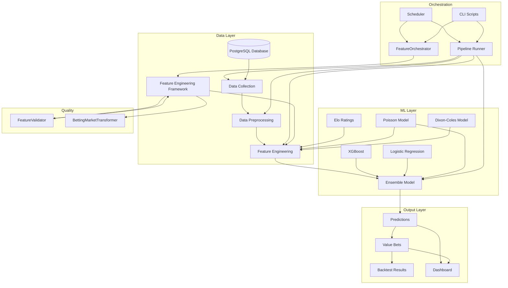
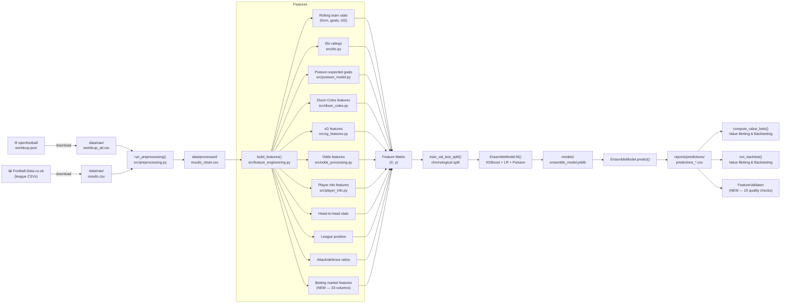

---
tags:
  - football-prediction
  - architecture
  - overview
created: 2026-07-12
---

# 🏗 Architecture Overview

> High-level architecture, data flow, module dependencies, and guiding principles.

See also: [[Quick Start Guide]], [[Feature Orchestrator]], [[Feature Validation Framework]], [[Feature Engineering Pipeline]], [[Ensemble Model]], [[Config System]], [[Runtime Sequence Diagrams]]

---

## High-Level Architecture

---

## Data Flow Pipeline

The end-to-end data flow from raw collection to predictions:

---

## Module Dependency Graph

```mermaid
graph TD
    CFG["config.py<br/>(singleton Config)"]
    RMC["run_pipeline.py"] --> CFG
    RMC --> FE1["src/feature_engineering.py"]
    RMC --> ENS1["src/ensemble.py"]
    TWC["train_worldcup.py"] --> CFG
    TWC --> FE1
    TWC --> TR1["src/train.py"]
    
    %% NEW: Feature Framework
    ORCH["src/feature_framework/orchestrator.py"] --> FE_FW["src/feature_framework/"]
    ORCH --> VAL_FW["src/feature_framework/validation/"]
    ORCH --> PLUG["src/feature_framework/plugins.py"]
    ORCH --> CFG
    
    CLI["src/feature_framework/orchestrator_cli.py"] --> ORCH
    
    BM["src/feature_framework/features/betting_market.py"] --> ORCH
    BM --> FE1
    
    VAL_FW --> FE1
    VAL_FW --> ORCH
    
    %% Existing Dependencies
    FE1 --> ELO["src/elo.py"]
    FE1 --> POI["src/poisson_model.py"]
    FE1 --> DCX["src/dixon_coles.py"]
    FE1 --> XG["src/xg_features.py"]
    FE1 --> PLAYER["src/player_info.py"]
    FE1 --> ODD["src/odds_processing.py"]
    ENS1 --> POI
    ENS1 --> CFG
    TR1 --> TSCV["src/time_series_cv.py"]
    
    COL["src/data_collection/collector.py"] --> WC["src/data_collection/sources/worldcup.py"]
    COL --> FDC["src/data_collection/sources/football_data_co_uk.py"]
    COL --> CLN["src/data_collection/cleaners.py"]
    
    UI["src/data_collection/sources/understat/importer.py"] --> UC["src/data_collection/sources/understat/client.py"]
    UI --> UP["src/data_collection/sources/understat/parser.py"]
    
    FB["src/data_collection/sources/fbref/scraper.py"] --> FBC["src/data_collection/sources/fbref/client.py"]
    FB --> FBP["src/data_collection/sources/fbref/parser.py"]
    
    ETL["src/etl/pipeline.py"] --> EX["src/etl/extract.py"]
    ETL --> VAL["src/etl/validate.py"]
    ETL --> CLEAN["src/etl/clean.py"]
    ETL --> NORM["src/etl/normalize.py"]
    ETL --> TRANS["src/etl/transform.py"]
    ETL --> STORE["src/etl/store.py"]
    
    PREP["src/preprocessing.py"] --> CLN
    VB["src/value_betting.py"] --> CFG
    BT["src/backtesting.py"] --> VB
    HT["src/hyperparameter_tuning.py"] --> TSCV
    EVAL["src/evaluate.py"] --> CFG
    PRED["src/predict.py"] --> CONF["src/confidence_scoring.py"]
    SCHED["src/scheduler/engine.py"] --> TSK["src/scheduler/tasks.py"]
    DASH["src/app/dashboard.py"] --> DP1["src/app/pages/1_Predict.py"]
    
    classDef entry fill:#2ecc71,stroke:#27ae60,color:white
    classDef core fill:#3498db,stroke:#2980b9,color:white
    classDef ml fill:#9b59b6,stroke:#8e44ad,color:white
    classDef data fill:#e67e22,stroke:#d35400,color:white
    classDef new fill:#e74c3c,stroke:#c0392b,color:white
    
    class RMC,TWC entry
    class FE1,ELO,POI,DCX,XG,PLAYER,ODD,CFG core
    class ENS1,TR1,HT,CONF ml
    class COL,WC,UI,FB,ETL,PREP data
    class ORCH,CLI,BM,VAL_FW new
```

---

## Architecture Principles

1. **Leakage prevention first** — all rolling features use `.shift(1)` to exclude the current match
2. **Chronological splits** — never shuffle time-series data (see [[Ensemble Model]])
3. **Composable config** — single `config` object with nested dataclasses (see [[Config System]])
4. **Ensemble by default** — 3 models beat any single model (see [[Ensemble Model]])
5. **Graceful degradation** — all optional features use placeholder values when data is unavailable
6. **Stateless modules** — pure functions wherever possible for testability
7. **Validated pipelines** — all computed features pass through [[Feature Validation Framework]] (NEW)
