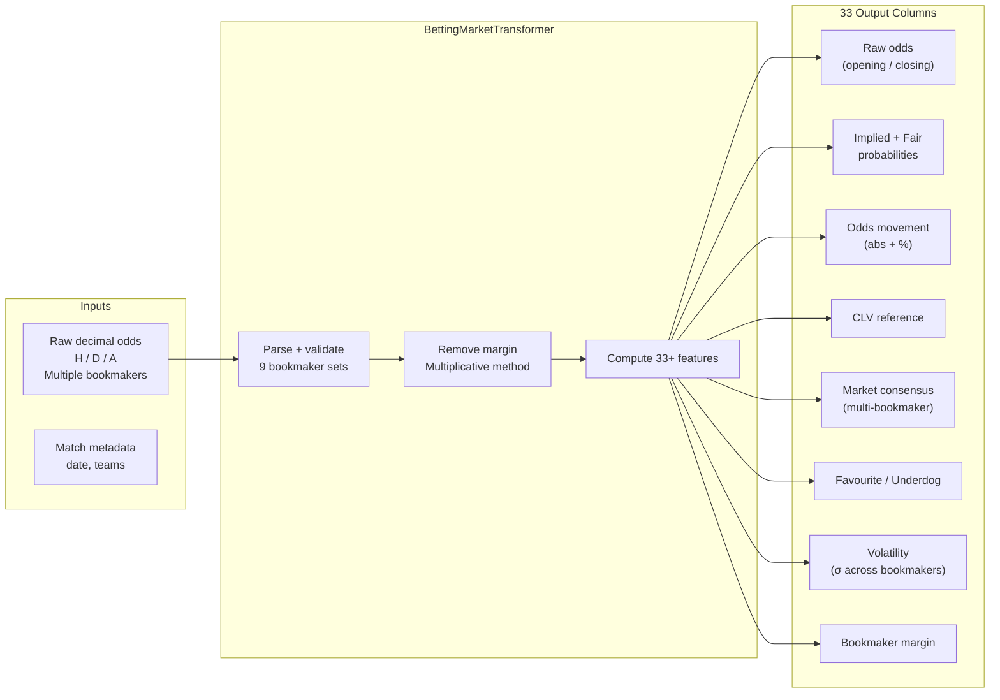

---
tags:
  - football-prediction
  - betting
  - features
  - odds
  - market
created: 2026-07-13
---

# 📈 Betting Market Features

> Computes 33+ betting market features per match: opening/closing odds, implied probability, odds movement, CLV, market consensus, favourite/underdog status, volatility, and bookmaker margin.

See also: [[Feature Orchestrator]], [[Feature Validation Framework]], [[Feature Engineering Pipeline]], [[Value Betting & Backtesting]]

---

## Overview

**File:** `src/feature_framework/features/betting_market.py`

**Transformer:** `BettingMarketTransformer`

**Tests:** `tests/test_feature_framework/test_betting_market.py` — 50 tests

Sources opening and closing odds from multiple bookmakers, removes overround, and produces rich market features for every match.

---

## Feature Categories



---

## 33 Output Columns

### Raw Odds (6 columns)

| Column | Description |
|--------|-------------|
| `odds_home_opening` | Opening decimal odds — home win |
| `odds_draw_opening` | Opening decimal odds — draw |
| `odds_away_opening` | Opening decimal odds — away win |
| `odds_home_closing` | Closing decimal odds — home win |
| `odds_draw_closing` | Closing decimal odds — draw |
| `odds_away_closing` | Closing decimal odds — away win |

### Implied & Fair Probability (6 columns)

| Column | Description |
|--------|-------------|
| `implied_prob_home_opening` | 1 / odds (includes margin) |
| `implied_prob_draw_opening` | 1 / odds |
| `implied_prob_away_opening` | 1 / odds |
| `fair_prob_home_closing` | Multiplicative no-margin probability |
| `fair_prob_draw_closing` | Multiplicative no-margin probability |
| `fair_prob_away_closing` | Multiplicative no-margin probability |

### Odds Movement (6 columns)

| Column | Description |
|--------|-------------|
| `odds_movement_home` | abs change: closing - opening |
| `odds_movement_draw` | abs change |
| `odds_movement_away` | abs change |
| `odds_movement_home_pct` | % change: (closing - opening) / opening |
| `odds_movement_draw_pct` | % change |
| `odds_movement_away_pct` | % change |

### CLV — Closing Line Value (3 columns)

| Column | Description |
|--------|-------------|
| `clv_home` | Fair prob closing - fair prob opening |
| `clv_draw` | CLV for draw |
| `clv_away` | CLV for away |

### Favourite & Underdog (4 columns)

| Column | Description |
|--------|-------------|
| `market_favourite` | Shortest-odds outcome (H/D/A) |
| `market_favourite_prob` | Fair probability of the favourite |
| `market_underdog` | Longest-odds outcome (H/D/A) |
| `market_confidence` | Favourite prob / total fair prob |

### Market Consensus & Volatility (4 columns)

| Column | Description |
|--------|-------------|
| `consensus_home` | Mean fair prob across all bookmakers |
| `consensus_draw` | Mean fair prob across all bookmakers |
| `consensus_away` | Mean fair prob across all bookmakers |
| `odds_volatility` | Std dev of fair probs across bookmakers |

### Bookmaker Margin (2 columns)

| Column | Description |
|--------|-------------|
| `bookmaker_margin_opening` | Σ implied prob - 1 (opening) |
| `bookmaker_margin_closing` | Σ implied prob - 1 (closing) |

### Market Favourite/Underdog Flags (2 columns)

| Column | Description |
|--------|-------------|
| `is_favourite_home` | True if home is market favourite |
| `is_underdog_home` | True if home is market underdog |

---

## Bookmaker Support

Auto-detects 9 standard bookmaker column prefixes:

| Prefix | Bookmaker |
|--------|-----------|
| `B365` | Bet365 |
| `BS` | Blue Square |
| `BW` | Bet&Win |
| `GB` | Gamebookers |
| `IW` | Interwetten |
| `LB` | Ladbrokes |
| `PS` | Pinnacle Sports |
| `SB` | Sportingbet |
| `SJ` | Stan James |
| `VC` | VC Bet |
| `WH` | William Hill |
| `Max` | Maximum (aggregated) |
| `Avg` | Average (aggregated) |

Supports custom bookmaker sets via `bookmaker_sets` parameter.

---

## Key Design Decisions

| Decision | Rationale |
|----------|-----------|
| **Multiplicative margin removal** | `fair = IP / (1 + margin)` — ensures Σ fair = 1 |
| **Time-aware sorting** | Chronological order ensures CLV is correctly computed |
| **NaN propagation** | Missing odds for some bookmakers don't block consensus |
| **Opening odds fallback** | If closing is missing, uses opening (and vice versa) |

---

## Usage

```python
from src.feature_framework.features.betting_market import BettingMarketTransformer

transformer = BettingMarketTransformer(
    bookmaker_sets=["B365", "PS", "Max"],  # or None for all
)
transformer.init()

result_df = transformer.transform(matches_df)
# result_df now has 33+ additional columns

# Validate output
errors = transformer.validate_output(result_df)
assert errors == []
```

## Integration

```python
from src.feature_framework import FeatureOrchestrator

orchestrator = FeatureOrchestrator(
    config_dict={
        "features": [
            {
                "name": "betting_market",
                "type": "betting_market",
                "category": "odds",
                "params": {"bookmaker_sets": ["B365", "PS"]},
            },
        ],
    },
)
orchestrator.plugins.register(BettingMarketTransformer)
```
