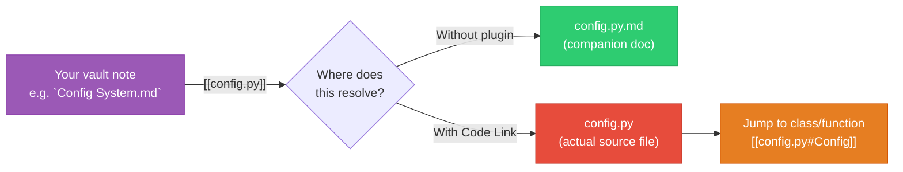

---
tags:
  - football-prediction
  - obsidian
  - plugins
  - setup
  - guide
created: 2026-07-12
---

# 🔗 Code Link Plugin — Wikilinks for `.py` Source Files

> Make `[[ensemble.py]]` resolve to the actual source file, not just the companion note.

---

## Quick Answer: Why Not Extended File Support?

The plugin **Extended File Support** (`extended-file-support`) is often suggested for handling non-markdown files, but it's designed for **binary/3D file previews** (`.psd`, `.kra`, `.gltf`, `.stl`) — it does **not** change how wikilinks resolve. `[[config.py]]` will still open the companion note, not the source file.

**The correct plugin for `.py` wikilinks is Code Link.**

---

## The Problem

By default, Obsidian wikilinks like `[[ensemble.py]]` only resolve to markdown files. In this vault, they find the companion `.py.md` notes — which is useful for documentation, but doesn't give you direct access to the live Python source code.

## The Solution: Code Link Plugin

**Plugin ID:** `code-link`  
**Author:** observerw  
**GitHub:** [github.com/observerw/obsidian-code-link](https://github.com/observerw/obsidian-code-link)

The **Code Link** plugin lets you use `[[wikilinks]]` to navigate to actual source code files (`.py`, `.js`, `.rs`, etc.) and even jump to specific **functions, classes, or methods** within them.

---

## How It Works



### What Changes

| Before (no plugin) | After (Code Link) |
|--------------------|-------------------|
| `[[config.py]]` → opens `config.py.md` companion note | `[[config.py]]` → opens `config.py` source file |
| Source files hidden in file explorer | Source files visible and navigable |
| No code symbol awareness | Jump to `[[ensemble.py#EnsembleModel]]` |
| Hover preview shows companion note | Hover preview shows source code snippet |

---

## Installation

```text
1. Open Obsidian → Settings (Ctrl+,)
2. Go to Community Plugins → Turn off Restricted Mode
3. Click Browse → search for "Code Link" (plugin ID: code-link)
4. Click Install → Enable
```

---

## Configuration

### Step 1: Enable unsupported file detection

This setting is **already configured** in this vault's `.obsidian/app.json` (`showUnsupportedFiles: true`), but verify it's active:

```text
Settings → Files & Links → Detect all file extensions → ✅ ON
```

### Step 2: Import the project

The plugin needs to index your source files:

```text
1. Open Command Palette (Ctrl/Cmd+P)
2. Run: "Code Link: Import project"
3. Browse to the project root (where src/ lives)
4. The plugin creates a link index — now [[wikilinks]] work
```

### Step 3: Configure file type associations (optional)

By default, Code Link supports `.py`, `.js`, `.ts`, `.rs`, `.go`, `.java`, and more.  
To add or remove file types:

```text
Settings → Code Link → File Extensions
→ Add or remove extensions in the list
```

### Step 4: Symbol indexing (recommended)

For function/class-level jumps:

```text
Settings → Code Link → Symbol Indexing → Enable
```

This parses Python files for `class`, `def`, and `async def` declarations so you can link like:

```
[[ensemble.py#EnsembleModel]]
[[elo.py#add_elo_features]]
[[config.py#Config]]
```

---

## Usage Examples

### Basic wikilink to a source file

```markdown
See the main settings in [[config.py]].
```

Clicking this opens `src/config.py` directly in Obsidian's editor.

### Link to a specific class

```markdown
The [[ensemble.py#EnsembleModel]] class orchestrates model predictions.
```

### Link to a specific function

```markdown
Features are built via [[feature_engineering.py#build_features]].
```

### Embed source code inline (via hover preview)

Hover over any Code Link wikilink to see a preview of the symbol's source code.

---

## How It Interacts with Companion Notes

The companion `.py.md` notes (e.g., `config.py.md`) and the Code Link plugin **complement each other**:

| You write... | Without Code Link | With Code Link |
|--------------|-------------------|----------------|
| `[[config.py]]` | → `config.py.md` (documentation) | → `config.py` (source code) |
| `[[config.py\|Config System]]` with display text | → `config.py.md` with alias | → `config.py` with alias |

**Tip:** Use `[[config.py\|Config System]]` in topic notes to link to source, while keeping descriptive display text. The companion notes remain accessible via their `[[Config System]]` topic wikilink.

---

## Troubleshooting

| Issue | Solution |
|-------|----------|
| **Wikilinks still open companion notes** | Run "Code Link: Index project" again from Command Palette |
| **`.py` files not appearing in file explorer** | Check `Settings → Files & Links → Detect all file extensions` |
| **Symbol links don't work** | Enable Symbol Indexing in Code Link settings, then re-index |
| **Plugin not in Community Plugins list** | Make sure you've disabled Restricted Mode in Community Plugins settings |

---

## Related

- [[Quick Start Guide]] — vault setup & other recommended plugins
- [[Football Prediction Codebase]] — vault home
- [[er_diagram]] — database schema reference
- [[performance_optimization]] — pipeline speed tips
