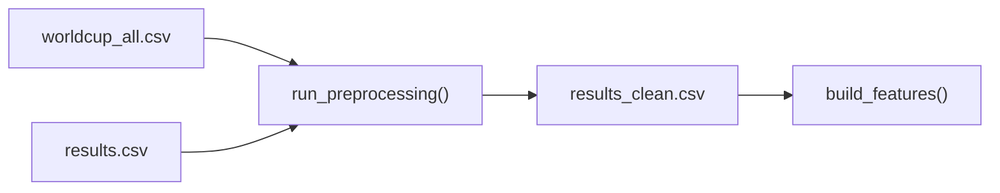

---
tags:
  - football-prediction
  - data
  - scraping
  - collection
created: 2026-07-12
---

# 🌐 Data Collection Sources

> Where match data comes from — multiple sources consolidated into a unified pipeline.

See also: [[Architecture Overview]], [[Feature Engineering Pipeline]], [[Config System]]

---

## Source Architecture

```mermaid
graph TB
    subgraph "Football-Data.co.uk"
        FDC["football_data_co_uk.py"] -->|"Bulk download<br/>league CSVs"| RAW["data/raw/<br/>results.csv"]
    end
    
    subgraph "openfootball (World Cup)"
        WC["worldcup.py"] -->|"worldcup.json<br/>2002-2026"| WC_RAW["data/raw/<br/>worldcup_all.csv"]
    end
    
    subgraph "Understat (xG Data)"
        UI["understat/importer.py"] --> UC["understat/client.py<br/>async HTTP"]
        UI --> UP["understat/parser.py<br/>JS eval parsing"]
        UI --> UM["understat/models.py<br/>MatchXG, ShotData, TeamXG"]
    end
    
    subgraph "FBref (Squad Stats)"
        FB["fbref/scraper.py"] --> FBC["fbref/client.py<br/>async + rate limiting"]
        FB --> FBP["fbref/parser.py<br/>HTML table parsing"]
        FB --> FBM["fbref/models.py<br/>7 stat categories"]
    end
    
    subgraph "Collector Orchestrator"
        COL["collector.py"] -->|collect_all()| FDC
        COL -->|collect_worldcup()| WC
        COL -->|update()| FDC
        COL --> CLN["cleaners.py"]
    end
```

---

## Source Details

### 1. Football-Data.co.uk (`football_data_co_uk.py`)

- **Data:** League match results with odds (B365, BbAv, BbMx)
- **Format:** CSV download per league per season
- **Leagues:** E0 (Premier League), E1 (Championship), etc.
- **Config:** `config.data_collection.leagues = ("E0",)`

### 2. openfootball (World Cup) (`worldcup.py`)

- **Data:** Tournament match data (groups + knockout)
- **URL:** `github.com/openfootball/worldcup.json`
- **Coverage:** 2002–2026
- **Placeholder handling:** Knockout rounds use `W101`, `R102` before teams are known
- **Functions:** `is_placeholder_team()`, `get_group_stage()`, `get_knockout_stage()`

### 3. Understat (`understat/`)

- **Data:** Per-shot xG data, match-level xG, team xG stats
- **Leagues:** EPL, La Liga, Bundesliga, Serie A, Ligue 1, RFPL
- **Features:** Async HTTP, JS eval parsing, incremental sync with checkpoint
- **Models:** `MatchXG`, `ShotData`, `TeamXG`

### 4. FBref (`fbref/`)

- **Data:** 7 stat categories (Standard, Shooting, Passing, Possession, Defense, Goalkeeping, Match)
- **Format:** HTML table scraping with BeautifulSoup
- **Features:** Async HTTP, rate limiting, caching, checkpoint/resume

### 5. Transfermarkt (`transfermarkt.py`)

- **Data:** Player squad info, market values, lineups
- **Used by:** `src/player_info.py` for injury/suspension/rotation features

---

## Consolidation

All sources feed into the preprocessing pipeline:



---

## Cleaners (`cleaners.py`)

Applies to all data:

| Operation | Description |
|-----------|-------------|
| `deduplicate()` | Remove exact + near-duplicate match rows |
| `handle_missing_values()` | Fill/drop per `config.data_collection.missing_strategy` |
| `standardise_schema()` | Ensure consistent column names and types |
| `validate_data()` | Check row count, nulls, value ranges |
