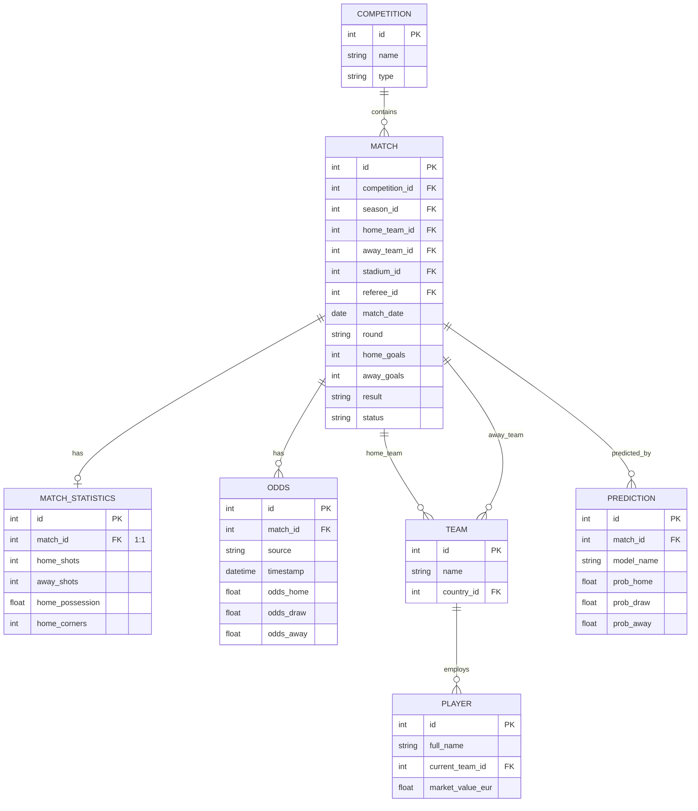

---
tags:
  - football-prediction
  - database
  - orm
  - schema
created: 2026-07-12
---

# 🗄 Database Schema

> Fully normalised PostgreSQL schema with 21 tables for football analytics.

See also: [[Architecture Overview]], [[Config System]], [[Auxiliary Modules]]

---

## ER Diagram (Core Tables)

---

## Table Groups

### 1. Core Entities (7 tables)

| Table | Est. Rows | Description |
|-------|-----------|-------------|
| `countries` | ~250 | ISO-coded country reference |
| `competitions` | ~500 | League/cup/tournament |
| `seasons` | ~5,000 | Time-bound grouping within competition |
| `teams` | ~10,000 | Club or national team |
| `stadiums` | ~5,000 | Venue info (city, capacity, surface) |
| `referees` | ~5,000 | Match officials |
| `players` | ~500,000 | Individual footballers |

### 2. Match Detail (5 tables)

| Table | Est. Rows | Link | Description |
|-------|-----------|------|-------------|
| `matches` | 10M+ | — | Central fact table (7 FKs) |
| `match_statistics` | = matches | 1:1 | Shots, possession, cards, corners |
| `weather` | = matches | 1:1 | Temperature, humidity, wind |
| `odds` | 50M+ | 1:N | Multi-bookmaker, multi-timestamp |
| `lineups` | 2× matches | 1:N | Formation, starting XI, substitutes |

### 3. Player Analytics (4 tables)

| Table | Est. Rows | Description |
|-------|-----------|-------------|
| `player_match_stats` | 100M+ | Per-match performance (goals, xG, rating) |
| `injuries` | 500K | Injury tracking (type, severity, return) |
| `transfers` | 200K | Transfer fees, loans, dates |

### 4. Team Analytics (3 tables)

| Table | Est. Rows | Description |
|-------|-----------|-------------|
| `team_elo_history` | 2× matches | Elo rating before/after each match |
| `team_form` | 2× matches | Rolling form at match time |
| `team_xg_history` | 2× matches | xG by source (opta, understat) |

### 5. Betting & Predictions (5 tables)

| Table | Est. Rows | Description |
|-------|-----------|-------------|
| `predictions` | = matches | Model probabilities, confidence |
| `expected_value_bets` | = matches | EV per match+bookmaker |
| `closing_line_values` | = matches | Opening-to-closing line movement |
| `betting_results` | = bets | Actual P&L tracking |

---

## Performance Optimizations

For large-scale queries, the schema uses:

- **Composite indexes** — `ix_matches_comp_season_date`, `ix_matches_home_date`, etc.
- **Partial indexes** — only index finished matches, positive EV bets
- **Table partitioning** — `matches`, `odds`, `player_match_stats` partitioned by month

---

## Full ER Diagram

See [[er_diagram]] for the complete 21-table ERD with all foreign keys and constraints.
