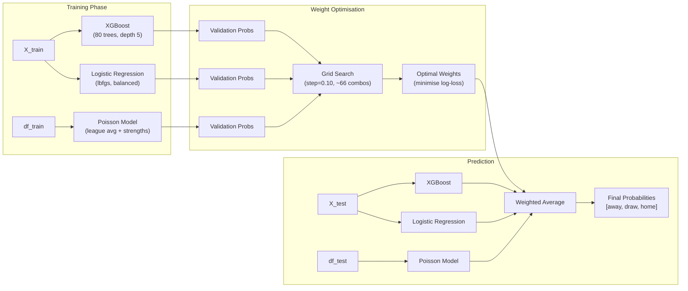
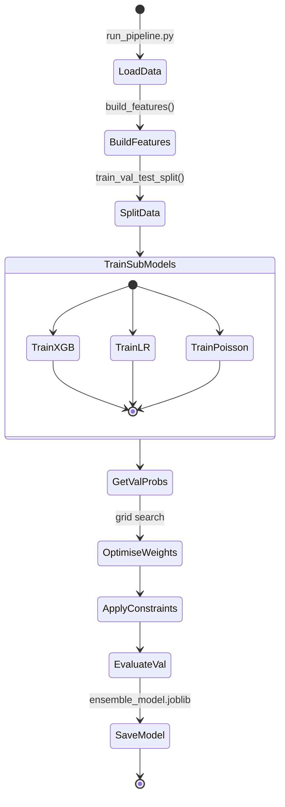

---
tags:
  - football-prediction
  - ensemble
  - model
  - ml
created: 2026-07-12
---

# 🧠 Ensemble Model

> Combines XGBoost, Logistic Regression, and Poisson using optimised weighted averaging — the **default prediction model**.

See also: [[Architecture Overview]], [[Feature Engineering Pipeline]], [[Poisson & Elo Models]], [[Config System]], [[Runtime Sequence Diagrams]]

---

## Overview

**File:** [[ensemble.py]]

Trains in **~20-40 seconds** on typical hardware by using:
- XGBoost (80 trees, depth 5, parallelised)
- Logistic Regression (seconds to train)
- Poisson (goal-based generative model)
- Weight grid search (~66 combinations at step=0.10)

---

## How It Works



---

## All Available Models

| Model | Type | File | Speed | When to Use |
|-------|------|------|-------|-------------|
| **XGBoost** | Gradient boosted trees | `src/train.py` | Fast | Default / primary |
| **Logistic Regression** | Linear classifier | `src/train.py` | Fastest | Baseline / calibration |
| **Poisson** | Goal-based generative | `src/poisson_model.py` | Medium | Goals prediction |
| **Dixon-Coles** | MLE with tau correction | `src/dixon_coles.py` | Slow | Small datasets |
| **Random Forest** | Bagged trees | `src/train.py` | Medium | Feature importance |
| **LightGBM** | Leaf-wise GBDT | `src/train.py` | Fast | Large data |
| **Neural Network** | PyTorch MLP | `src/train.py` | Slow | Research |
| **Ensemble (default)** | Weighted average | `src/ensemble.py` | Fast ✓ | **Default** |

---

## Training Flow



---

## API Reference

```python
from src.ensemble import EnsembleModel

# Train
ensemble = EnsembleModel()
report = ensemble.fit(
    X_train, y_train,
    X_val, y_val,
    df_train=df_train,  # raw data for Poisson
    df_val=df_val,
)

# Predict
probs = ensemble.predict_proba(X_test, df_raw=df_test)
preds = ensemble.predict(X_test, df_raw=df_test)

# Evaluate
metrics = ensemble.evaluate(X_test, y_test, df_test)

# Save / Load
ensemble.save("models/ensemble.joblib")
loaded = EnsembleModel.load("models/ensemble.joblib")
```

---

## Configuration

```python
from config import config

config.ensemble.model_names = (
    "xgboost", "logistic_regression", "poisson"
)
config.ensemble.weight_grid_step = 0.10
config.train.n_estimators = 80   # per sub-model
config.train.max_depth = 5
```
