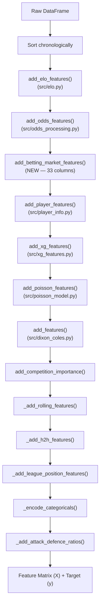

---
tags:
  - football-prediction
  - features
  - engineering
created: 2026-07-12
---

# 🔧 Feature Engineering Pipeline

> The most complex module — orchestrates all feature creation in a strict order with leakage prevention.

See also: [[Architecture Overview]], [[Feature Orchestrator]], [[Feature Validation Framework]], [[Betting Market Features]], [[Ensemble Model]], [[Config System]], [[Poisson & Elo Models]], [[Data Collection Sources]]

---

## Feature Creation Order

**Files:** [[feature_engineering.py]], [[Betting Market Features]] (NEW)

---

## Leakage Prevention

**This is the #1 design rule.** Every rolling feature uses `.shift(1)` so the current match's data never leaks into its own features.

| Pattern | What Happens |
|---------|-------------|
| `.rolling(N).mean().shift(1)` | Rolling avg of last N matches, *excluding* current |
| `.expanding().mean().shift(1)` | All-time avg, *excluding* current |
| Chronological sort | Features always computed on past → future order |
| **FeatureValidator** (NEW) | Automatic leakage detection via date-sort check |

The [[Feature Validation Framework]] automatically validates that feature dataframes are chronologically sorted, catching any accidental leakage at pipeline runtime.

---

## Feature Categories

### 1. Elo Ratings (`src/elo.py`)

| Feature | Description |
|---------|-------------|
| `Home_Elo` | Home team's Elo rating **before** the match |
| `Away_Elo` | Away team's Elo rating **before** the match |
| `Elo_Difference` | `Home_Elo - Away_Elo` |

Parameters from `config.elo`: `k=32`, `home_advantage=100`, `initial_rating=1500`

### 2. Odds Processing (`src/odds_processing.py`)

| Feature | Description |
|---------|-------------|
| `odds_{home,draw,away}_{opening,closing}` | Raw decimal odds |
| `fair_prob_{home,draw,away}_{opening,closing}` | No-margin probabilities |
| `odds_movement_{home,draw,away}` | Closing - opening odds |
| `clv_{home,draw,away}` | Closing Line Value (change in fair prob) |
| `market_favorite` | Shortest-odds outcome (H/D/A) |
| `market_confidence` | Fair prob of the favorite |
| `bookmaker_margin_{opening,closing}` | Overround |

### 3. Betting Market Features (NEW — `src/feature_framework/features/betting_market.py`)

| Feature | Description |
|---------|-------------|
| `odds_{home,draw,away}_{opening,closing}` | Raw decimal odds from 9+ bookmakers |
| `fair_prob_{home,draw,away}_{opening,closing}` | Multiplicative no-margin probs |
| `odds_movement_{home,draw,away}_{,pct}` | Abs + % change from opening to closing |
| `clv_{home,draw,away}` | Closing Line Value |
| `market_favourite`, `market_underdog` | Shortest/longest outcome |
| `market_confidence` | Favourite prob / total fair prob |
| `consensus_{home,draw,away}` | Mean fair prob across bookmakers |
| `odds_volatility` | Std dev of fair probs |
| `bookmaker_margin_{opening,closing}` | Σ implied prob - 1 |
| `is_favourite_home`, `is_underdog_home` | Flags for home team |

→ Full details: [[Betting Market Features]]

### 4. Player Info (`src/player_info.py`) — Optional

| Feature | Description |
|---------|-------------|
| `{h,a}_injured_count` | Number of injured players |
| `{h,a}_suspended_count` | Number of suspended players |
| `{h,a}_missing_gk` | Starting GK unavailable (binary) |
| `{h,a}_missing_top_scorer` | Top scorer unavailable (binary) |
| `{h,a}_rotation_index` | Changes from last XI / 11 |
| `{h,a}_avg_age` | Average squad age |
| `{h,a}_squad_value` | Total market value (€m) |

### 5. xG Features (`src/xg_features.py`)

| Feature | Description |
|---------|-------------|
| `{h,a}_xg_avg5` / `{h,a}_xg_avg10` | Rolling xG average |
| `{h,a}_xga_avg5` / `{h,a}_xga_avg10` | Rolling xGA (conceded) average |
| `{h,a}_xgd_avg5` / `{h,a}_xgd_avg10` | Rolling xG difference |
| `{h,a}_xpts` | Expected Points from Poisson conversion |

### 6. Poisson Features (`src/poisson_model.py`)

| Feature | Description |
|---------|-------------|
| `Expected_Home_Goals` | λ_home = μ_home × α_home × β_away |
| `Expected_Away_Goals` | λ_away = μ_away × α_away × β_home |
| `Expected_Total_Goals` | λ_home + λ_away |
| `Expected_Goal_Difference` | λ_home - λ_away |
| `{Home,Away}_{Attack,Defense}_Strength` | α and β parameters |

### 7. Dixon-Coles Features (`src/dixon_coles.py`) — Optional

| Feature | Description |
|---------|-------------|
| `DC_Expected_Home_Goals` | λ_home from MLE model (with τ correction) |
| `DC_Expected_Away_Goals` | λ_away from MLE model |
| `DC_Expected_Total_Goals` | Sum |
| `DC_Expected_Goal_Difference` | Difference |
| `DC_{Home,Away}_{Attack,Defence}_Weakness` | α and β from MLE |
| `DC_{Home,Draw,Away}_Win_Prob` | Outcome probabilities |
| `DC_Rho` | Tau correction parameter |

### 8. Rolling Team Features

| Feature | Description |
|---------|-------------|
| `{h,a}_points_avg{5,10,20}` | Avg points per match, last N |
| `{h,a}_goals_scored_avg{5,10,20}` | Avg goals scored, last N |
| `{h,a}_goals_conceded_avg{5,10,20}` | Avg goals conceded, last N |
| `{h,a}_goal_diff_avg{5,10,20}` | Avg goal difference, last N |
| `{h,a}_win_rate_{home,away,overall}` | Expanding win rate |
| `{h,a}_days_since_last_match` | Rest days |
| `{h,a}_matches_this_season` | Matches played so far |

### 9. Head-to-Head & League Position

| Feature | Description |
|---------|-------------|
| `h2h_{home,away}_points_avg` | Avg points vs this opponent |
| `h2h_{home,away}_goals_avg` | Avg goals vs this opponent |
| `h2h_home_win_rate` | H2H win rate |
| `h2h_matches_played` | H2H match count |
| `{h,a}_league_position` | League table rank before kickoff |
| `position_diff` | `|h_position - a_position|` |

### 10. Attack/Defence Ratios

| Feature | Description |
|---------|-------------|
| `{h,a}_attack_ratio{5,10,20}` | `goals_scored_avg / league_avg` |
| `{h,a}_defence_ratio{5,10,20}` | `goals_conceded_avg / league_avg` |

---

## Feature Framework (NEW)

The [[Feature Orchestrator]] provides a production-grade pipeline for computing all features with:

| Capability | How It Helps |
|------------|-------------|
| **Plugin-based** | Features auto-discover via `FeaturePluginRegistry` |
| **Declarative** | Feature definitions in YAML, not code |
| **Dependency resolution** | DAG ensures features compute in correct order |
| **Parallel by default** | Thread/process pool execution |
| **Validated output** | [[Feature Validation Framework]] checks every computed value |

---

## `src/data/` Subpackage

A lighter-weight alternative feature builder:

| File | Class | Purpose |
|------|-------|---------|
| `src/data/loader.py` | `DataLoader` | Load from CSV / Parquet / database |
| `src/data/cleaners.py` | `DataCleaner` | Source-specific cleaning |
| `src/data/feature_engineering.py` | `FeatureEngineer` | Simpler feature builder (form + Elo + H2H) |
