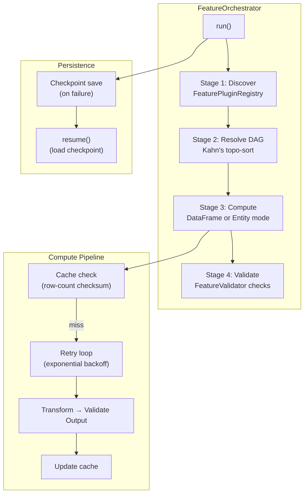

---
tags:
  - football-prediction
  - orchestrator
  - pipeline
  - features
created: 2026-07-13
---

# 🏗 Feature Pipeline Orchestrator

> Production-grade pipeline execution with automatic discovery, dependency resolution, caching, retry, resume, parallelism, progress tracking, logging, metrics, and incremental updates.

See also: [[Feature Validation Framework]], [[Betting Market Features]], [[Feature Engineering Pipeline]], [[Config System]], [[Football Prediction Codebase]]

---

## Overview

**Files:**
- [[orchestrator.py]] — `FeatureOrchestrator` class (~650 lines)
- [[orchestrator_cli.py]] — 5 CLI commands (~410 lines)
- `tests/test_feature_framework/test_orchestrator.py` — 72 tests

The orchestrator replaces the manual `run_pipeline.py` approach with a pluggable, config-driven pipeline that resolves feature dependencies, caches intermediate results, and auto-retries failures.

---

## Architecture



---

## 11 Responsibilities

| # | Responsibility | Implementation | Tests |
|---|---------------|----------------|:-----:|
| 1 | **Discover** | `FeaturePluginRegistry` auto-finds transformers | 5 |
| 2 | **Resolve DAG** | Kahn's algorithm + cycle detection | 6 |
| 3 | **Execute order** | DAG-ordered (parallel where possible) | 7 |
| 4 | **Cache** | Row-count based metadata checksum | 6 |
| 5 | **Retry** | Exponential backoff, configurable attempts | 1 |
| 6 | **Resume** | Checkpoint save/load, `resume()` method | 5 |
| 7 | **Parallel** | Thread/process pools, configurable workers | — |
| 8 | **Progress** | `tqdm` progress bars + per-feature timing | — |
| 9 | **Logging** | Structured JSON logs per pipeline run | 3 |
| 10 | **Metrics** | Timing, counts, success rates, history | 3 |
| 11 | **Incremental** | Skip unchanged features, `force_recompute` | 1 |

---

## Modes of Operation

### DataFrame Mode

Processes features by passing the entire DataFrame through each transformer in DAG order:

```python
report = orchestrator.run(
    entity_type="dataframe",
    df=my_dataframe,
    trigger="manual",
)
```

### Entity Mode

Processes features one entity at a time via `FeatureStore`:

```python
report = orchestrator.run(
    entity_type="match",
    entity_ids=[101, 102, 103],
    trigger="scheduled",
)
```

---

## Report Format

```python
report = orchestrator.run(df=df)

print(report.summary())
# FEATURE PIPELINE ORCHESTRATOR REPORT
# =========================================
#   Run ID:       abc12345...
#   Trigger:      manual
#   Duration:     12.34s
#   Result:       ✅ PASS
#   Features:     5 configured, 4 computed, 1 cached, 1 failed

# Per-feature details
for name, record in report.features.items():
    print(f"{name}: {record.status} in {record.duration:.3f}s")
```

---

## CLI Reference

| Command | Description |
|---------|-------------|
| `build-features` | Full pipeline execution with input → output |
| `validate-features` | FeatureValidator integration with report output |
| `recompute-feature` | Single feature recompute by name |
| `list-features` | Enumerate with type/category filtering |
| `feature-status` | Detailed status with dependencies, columns |

```bash
# Build features
python -m src.feature_framework.orchestrator_cli build-features \
    --input matches.csv --output features.csv

# List all configured features
python -m src.feature_framework.orchestrator_cli list-features

# Validate computed features
python -m src.feature_framework.orchestrator_cli validate-features \
    --input features.csv
```

---

## Key Classes

| Class | Purpose |
|-------|---------|
| `FeatureOrchestrator` | Main pipeline orchestrator with all 11 responsibilities |
| `OrchestratorReport` | Complete run report (summary, to_dict, per-feature records) |
| `FeatureExecutionRecord` | Per-feature status, timing, retries, output columns |
| `FeatureStatus` | Enum: pending, running, completed, skipped, failed, cached |
| `OrchestratorStage` | Enum: discover, resolve, compute, validate, store |

## Configuration

```yaml
pipeline:
  default_entity_type: match
  show_progress: true
  max_retries: 2
  parallel: true

features:
  - name: elo_rating
    type: elo
    category: elo_rating
    output_columns: [h_elo, a_elo]
    dependencies: []
    params:
      k: 32
      home_advantage: 100
```
