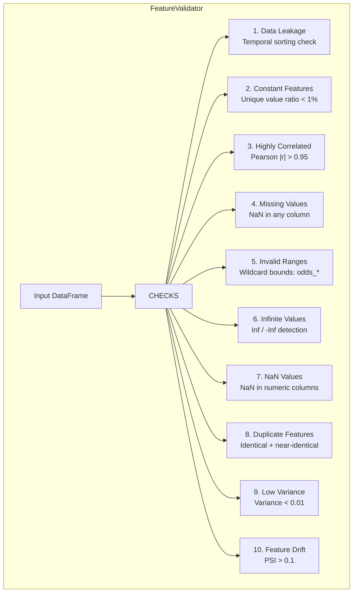

---
tags:
  - football-prediction
  - validation
  - features
  - data-quality
created: 2026-07-13
---

# ✅ Feature Validation Framework

> Production-grade validation for computed features. Automatically detects 10 categories of data quality issues and generates 5 report types.

See also: [[Feature Orchestrator]], [[Betting Market Features]], [[Feature Engineering Pipeline]], [[Config System]]

---

## Overview

**File:** `src/feature_framework/validation/`
- `__init__.py` — `FeatureValidator` orchestrator
- `checks.py` — 10 standalone check functions + PSI computation
- `report.py` — 5 report dataclass types

**Tests:** `tests/test_feature_framework/test_feature_validation.py` — 77 tests

---

## Detection Checks



| # | Check | Threshold | Description |
|---|-------|-----------|-------------|
| 1 | **Data Leakage** | — | Detects unsorted dates, out-of-order rows |
| 2 | **Constant Features** | `min_unique_ratio=0.01` | Zero-variance columns |
| 3 | **Highly Correlated** | `correlation_threshold=0.95` | Feature pairs with \|r\| > threshold |
| 4 | **Missing Values** | — | NaN/null in any column |
| 5 | **Invalid Ranges** | Per-column bounds | Values outside expected bounds (wildcard support) |
| 6 | **Infinite Values** | — | Inf / -Inf in numeric columns |
| 7 | **NaN Values** | — | NaN in numeric columns specifically |
| 8 | **Duplicate Features** | r > 0.999 | Identical or near-identical columns |
| 9 | **Low Variance** | `variance_threshold=0.01` | Variance below threshold |
| 10 | **Feature Drift** | `drift_threshold=0.1` | Distribution change vs reference (PSI) |

---

## Reports

### Validation Report

Aggregated results from all checks:

```python
report = validator.validate(df)
print(report.summary())
# FEATURE VALIDATION REPORT
# =========================================
#   Data:         100 rows × 10 columns
#   Checks:       10/10 passed
#   Result:       ✅ PASS
```

| Property | Description |
|----------|-------------|
| `report.passed` | True if all checks pass |
| `report.failed_checks` | Count of failed checks |
| `report.total_violations` | Total violations across all checks |
| `report.violations_dataframe` | Flattened DataFrame of all violations |
| `report.to_dict()` | Serializable dict |

### Correlation Matrix

```python
report = validator.correlation_matrix(df)
report.n_high_pairs       # Pairs with |r| > threshold
report.high_correlation_pairs  # List of {feature_1, feature_2, correlation}
```

### Missing Value Report

```python
report = validator.missing_value_report(df)
report.n_missing_cells   # Total NaN cells
report.missing_rate      # Proportion of all cells missing
report.to_dataframe()    # Per-column details as DataFrame
```

### Drift Report (PSI)

| PSI Value | Interpretation |
|-----------|----------------|
| < 0.1 | No significant drift |
| 0.1 – 0.25 | Moderate drift — investigate |
| > 0.25 | Significant drift — retrain recommended |

```python
report = validator.drift_report(current_df, reference_df)
report.passed       # True if no features drifted
report.n_drifted     # Count of drifted features
```

### Feature Importance Placeholder

```python
placeholder = validator.feature_importance_placeholder(
    feature_names=df.columns.tolist(),
    model_type="xgboost",
)
# Actual importance values require a trained model
```

---

## Pipeline Integration

The `FeatureValidator` is automatically integrated into both `FeaturePipeline` and `FeatureOrchestrator`:

```python
from src.feature_framework import FeaturePipeline

pipeline = FeaturePipeline(...)
report = pipeline.run(entity_type="dataframe", df=matches_df)
# report.validation contains validation results
```

The orchestrator runs validation in Stage 4 after all features are computed. If violations are found, a warning is logged but the pipeline continues.

---

## Configuration

```python
validator = FeatureValidator(
    checks=["constant_features", "missing_values", "nan_values"],
    correlation_threshold=0.90,
    variance_threshold=0.001,
    drift_threshold=0.2,
    min_unique_ratio=0.005,
    range_bounds={
        "odds_*": (1.0, 100.0),
        "fair_prob_*": (0.0, 1.0),
        "clv_*": (-0.5, 0.5),
    },
    date_column="date",
    verbose=True,
)
```
