```mermaid
graph TD
    HOME["🏠 Vault Home"] --> QS["Quick Start Guide"]
    HOME --> ARCH["Architecture Overview"]
    HOME --> ORCH["Feature Orchestrator"]
    HOME --> VAL["Feature Validation Framework"]
    HOME --> CONFIG["Config System"]
    HOME --> SCRIPTS["Scripts Reference"]
    HOME --> FE["Feature Engineering Pipeline"]
    HOME --> BM["Betting Market Features"]
    HOME --> ENS["Ensemble Model"]
    HOME --> POI["Poisson & Elo Models"]
    HOME --> AUX["Auxiliary Modules"]
    HOME --> DC["Data Collection Sources"]
    HOME --> DB["Database Schema"]
    HOME --> VB["Value Betting & Backtesting"]
    HOME --> SEQ["Runtime Sequence Diagrams"]
    HOME --> SCHED["Scheduler & Dashboard"]
    
    style HOME fill:#2ecc71,stroke:#27ae60,color:white,stroke-width:3px
    style QS fill:#3498db,stroke:#2980b9,color:white
    style ORCH fill:#3498db,stroke:#2980b9,color:white
    style VAL fill:#3498db,stroke:#2980b9,color:white
    style ARCH fill:#3498db,stroke:#2980b9,color:white
    style CONFIG fill:#3498db,stroke:#2980b9,color:white
    style SCRIPTS fill:#3498db,stroke:#2980b9,color:white
    style FE fill:#9b59b6,stroke:#8e44ad,color:white
    style BM fill:#9b59b6,stroke:#8e44ad,color:white
    style ENS fill:#9b59b6,stroke:#8e44ad,color:white
    style POI fill:#9b59b6,stroke:#8e44ad,color:white
    style AUX fill:#9b59b6,stroke:#8e44ad,color:white
    style DC fill:#e67e22,stroke:#d35400,color:white
    style DB fill:#e67e22,stroke:#d35400,color:white
    style VB fill:#e74c3c,stroke:#c0392b,color:white
    style SEQ fill:#e74c3c,stroke:#c0392b,color:white
    style SCHED fill:#f39c12,stroke:#e67e22,color:white
```

---
tags:
  - football-prediction
  - home
  - index
  - architecture
created: 2026-07-12
---

# ⚽ Football Prediction — Vault Home

> **Obsidian Vault** — Comprehensive documentation of the football prediction codebase.

---

## 🚀 Getting Started

| Note | Description |
|------|-------------|
| [[Quick Start Guide]] | Setup, installation, fastest path to predictions |

---

## 🏗 Architecture

| Note | Description |
|------|-------------|
| [[Architecture Overview]] | High-level architecture, data flow, module dependency graph |
| [[Feature Orchestrator]] | Production-grade pipeline execution (DAG, cache, retry, resume) |
| [[Feature Validation Framework]] | 10 automatic quality checks, 5 report types |
| [[Config System]] | Central configuration singleton (18 sub-configs) |
| [[Scripts Reference]] | Complete CLI scripts reference + key data files |

---

## 🔧 Core Modules

| Note | Description |
|------|-------------|
| [[Feature Engineering Pipeline]] | Feature creation hub — all 10+ feature categories |
| [[Betting Market Features]] | 33+ betting market features (odds, CLV, consensus, volatility) |
| [[Ensemble Model]] | Default prediction model (XGBoost + LR + Poisson) |
| [[Poisson & Elo Models]] | Statistical models for team strength estimation |
| [[Auxiliary Modules]] | Training, evaluation, calibration, hyperparameter tuning |

---

## 📊 Data

| Note | Description |
|------|-------------|
| [[Data Collection Sources]] | Football-Data.co.uk, openfootball, Understat, FBref, Transfermarkt |
| [[Database Schema]] | 21-table PostgreSQL ORM schema |

---

## 💰 Betting & Analysis

| Note | Description |
|------|-------------|
| [[Value Betting & Backtesting]] | Value bet detection, Kelly staking, backtesting engine |
| [[Runtime Sequence Diagrams]] | 6 Mermaid sequence diagrams of runtime interactions |

---

## ⏰ Automation

| Note | Description |
|------|-------------|
| [[Scheduler & Dashboard]] | Task engine, ETL pipeline, Streamlit dashboard |

---

## 📖 Full Reference

| Resource | Location |
|----------|----------|
| ER Diagram (21 tables) | [[er_diagram]] |
| Performance Optimization | [[performance_optimization]] |
| Source Code | `src/` directory |
| Entry Points | `run_pipeline.py`, `train_worldcup.py` |

---

---

> **💡 Tip:** Use Obsidian's Graph View (Ctrl/Cmd+G) to see all notes and their [[wikilink]] connections visually!

---

## 🔗 Companion Module Dependency Graph

> All 28+ companion `.py.md` notes and their `See also:` connections. Each node is a [[wikilink]] — click to open in Obsidian.

```mermaid
graph TB
    %% ── Style definitions ──────────────────────────────
    classDef core fill:#2ecc71,stroke:#27ae60,color:#fff,stroke-width:2px
    classDef features fill:#9b59b6,stroke:#8e44ad,color:#fff
    classDef data fill:#3498db,stroke:#2980b9,color:#fff
    classDef model fill:#e67e22,stroke:#d35400,color:#fff
    classDef eval fill:#1abc9c,stroke:#16a085,color:#fff
    classDef betting fill:#e74c3c,stroke:#c0392b,color:#fff
    classDef dataSub fill:#5dade2,stroke:#2e86c1,color:#fff,stroke-dasharray: 4 2
    classDef newFramework fill:#2ecc71,stroke:#27ae60,color:#fff,stroke-dasharray: 6 2

    %% ── Subgraph: Core / Entry Points ────────────────
    subgraph Core["⚙️ Core & Entry"]
        config_py["[[config.py]]<br/><small>Settings hub</small>"]
        run_pipeline_py["[[run_pipeline.py]]<br/><small>Pipeline orchestrator</small>"]
    end

    %% ── Subgraph: NEW — Feature Framework ────────────
    subgraph FeatureFramework["🏗️ Feature Framework (NEW)"]
        orchestrator_py["[[orchestrator.py]]<br/><small>FeatureOrchestrator</small>"]
        orchestrator_cli_py["[[orchestrator_cli.py]]<br/><small>CLI commands</small>"]
        validation_init_py["[[validation/__init__.py]]<br/><small>FeatureValidator</small>"]
        betting_market_py["[[betting_market.py]]<br/><small>BettingMarketTransformer</small>"]
    end

    %% ── Subgraph: Feature Engineering ────────────────
    subgraph Features["🔧 Feature Engineering"]
        feature_engineering_py["[[feature_engineering.py]]<br/><small>Feature creation hub</small>"]
        elo_py["[[elo.py]]<br/><small>Elo ratings</small>"]
        poisson_model_py["[[poisson_model.py]]<br/><small>Poisson goals</small>"]
        dixon_coles_py["[[dixon_coles.py]]<br/><small>Dixon-Coles MLE</small>"]
        xg_features_py["[[xg_features.py]]<br/><small>xG rolling features</small>"]
        odds_processing_py["[[odds_processing.py]]<br/><small>Odds normalisation</small>"]
        player_info_py["[[player_info.py]]<br/><small>Transfermarkt data</small>"]
    end

    %% ── Subgraph: Data Layer ─────────────────────────
    subgraph DataLayer["📦 Data Layer"]
        preprocessing_py["[[preprocessing.py]]<br/><small>Initial prep</small>"]
        data_loader_py["[[data_loader.py]]<br/><small>CSV loader (legacy)</small>"]

        subgraph DataSub["📁 data/ subpackage"]
            data_cleaners_py["[[data/cleaners.py]]<br/><small>Cleaning utils</small>"]
            data_loader_sub_py["[[data/loader.py]]<br/><small>Loader (modern)</small>"]
            data_fe_py["[[data/feature_engineering.py]]<br/><small>Feature transforms</small>"]
        end
    end

    %% ── Subgraph: Models & Training ──────────────────
    subgraph Models["🧠 Models & Training"]
        ensemble_py["[[ensemble.py]]<br/><small>Default ensemble</small>"]
        train_py["[[train.py]]<br/><small>Model training</small>"]
        hyperparameter_tuning_py["[[hyperparameter_tuning.py]]<br/><small>Hyper-param search</small>"]
        time_series_cv_py["[[time_series_cv.py]]<br/><small>Time-series CV</small>"]
        predict_py["[[predict.py]]<br/><small>Match prediction</small>"]
    end

    %% ── Subgraph: Evaluation ─────────────────────────
    subgraph Evaluation["📊 Evaluation"]
        evaluate_py["[[evaluate.py]]<br/><small>Metrics & reports</small>"]
        calibration_py["[[calibration.py]]<br/><small>Prob calibration</small>"]
        eda_py["[[eda.py]]<br/><small>Exploratory analysis</small>"]
    end

    %% ── Subgraph: Betting & Backtesting ──────────────
    subgraph Betting["💰 Betting & Value"]
        value_betting_py["[[value_betting.py]]<br/><small>EV & Kelly calc</small>"]
        backtesting_py["[[backtesting.py]]<br/><small>Backtest engine</small>"]
        confidence_scoring_py["[[confidence_scoring.py]]<br/><small>Confidence score</small>"]
    end

    %% ── Edges: Feature Framework ─────────────────────
    orchestrator_py --> orchestrator_cli_py
    orchestrator_py --> validation_init_py
    orchestrator_py --> betting_market_py
    orchestrator_py --> feature_engineering_py
    orchestrator_py --> config_py

    %% ── Edges: Feature Engineering ───────────────────
    run_pipeline_py --> ensemble_py
    run_pipeline_py --> feature_engineering_py
    run_pipeline_py --> config_py

    feature_engineering_py --> elo_py
    feature_engineering_py --> poisson_model_py
    feature_engineering_py --> dixon_coles_py
    feature_engineering_py --> xg_features_py
    feature_engineering_py --> odds_processing_py
    feature_engineering_py --> player_info_py
    feature_engineering_py --> config_py

    elo_py --> config_py
    elo_py --> feature_engineering_py

    poisson_model_py --> elo_py
    poisson_model_py --> dixon_coles_py
    poisson_model_py --> ensemble_py
    poisson_model_py --> feature_engineering_py

    dixon_coles_py --> poisson_model_py
    dixon_coles_py --> elo_py
    dixon_coles_py --> feature_engineering_py
    dixon_coles_py --> config_py

    xg_features_py --> feature_engineering_py

    odds_processing_py --> value_betting_py
    odds_processing_py --> feature_engineering_py
    odds_processing_py --> config_py

    player_info_py --> feature_engineering_py
    player_info_py --> config_py

    %% ── Edges: Data Layer ────────────────────────────
    preprocessing_py --> data_cleaners_py
    preprocessing_py --> data_loader_sub_py
    preprocessing_py --> feature_engineering_py
    preprocessing_py --> config_py

    data_loader_py --> data_loader_sub_py
    data_loader_py --> data_cleaners_py
    data_loader_py --> preprocessing_py

    data_cleaners_py --> preprocessing_py
    data_cleaners_py --> data_loader_sub_py
    data_cleaners_py --> data_fe_py
    data_cleaners_py --> config_py

    data_loader_sub_py --> data_cleaners_py
    data_loader_sub_py --> data_loader_py
    data_loader_sub_py --> data_fe_py
    data_loader_sub_py --> config_py

    data_fe_py --> data_cleaners_py
    data_fe_py --> data_loader_sub_py
    data_fe_py --> feature_engineering_py
    data_fe_py --> config_py

    %% ── Edges: Models & Training ─────────────────────
    ensemble_py --> config_py
    ensemble_py --> poisson_model_py
    ensemble_py --> train_py

    train_py --> config_py
    train_py --> ensemble_py
    train_py --> hyperparameter_tuning_py
    train_py --> time_series_cv_py

    hyperparameter_tuning_py --> train_py
    hyperparameter_tuning_py --> config_py
    hyperparameter_tuning_py --> time_series_cv_py

    time_series_cv_py --> hyperparameter_tuning_py
    time_series_cv_py --> ensemble_py
    time_series_cv_py --> train_py

    predict_py --> ensemble_py
    predict_py --> feature_engineering_py
    predict_py --> train_py

    %% ── Edges: Evaluation ────────────────────────────
    evaluate_py --> calibration_py
    evaluate_py --> train_py
    evaluate_py --> ensemble_py

    calibration_py --> ensemble_py
    calibration_py --> evaluate_py
    calibration_py --> config_py

    eda_py --> evaluate_py

    %% ── Edges: Betting ───────────────────────────────
    value_betting_py --> backtesting_py
    value_betting_py --> config_py
    value_betting_py --> ensemble_py
    value_betting_py --> confidence_scoring_py

    backtesting_py --> value_betting_py
    backtesting_py --> config_py
    backtesting_py --> ensemble_py

    confidence_scoring_py --> ensemble_py
    confidence_scoring_py --> calibration_py
    confidence_scoring_py --> value_betting_py

    %% ── Apply styles ─────────────────────────────────
    class config_py,run_pipeline_py core
    class orchestrator_py,orchestrator_cli_py,validation_init_py,betting_market_py newFramework
    class feature_engineering_py,elo_py,poisson_model_py,dixon_coles_py,xg_features_py,odds_processing_py,player_info_py features
    class preprocessing_py,data_loader_py data
    class data_cleaners_py,data_loader_sub_py,data_fe_py dataSub
    class ensemble_py,train_py,hyperparameter_tuning_py,time_series_cv_py,predict_py model
    class evaluate_py,calibration_py,eda_py eval
    class value_betting_py,backtesting_py,confidence_scoring_py betting
```

**Legend:** 🟢 Core & Entry | 🟢🏗️ Feature Framework (NEW) | 🟣 Feature Engineering | 🔵 Data Layer | 🟠 Models & Training | 🟢 Evaluation | 🔴 Betting & Value

> **Reading the graph:** Each arrow A → B means note A has `See also: [[B]]` in its YAML footer. Hover/tap a node in Obsidian to see connections highlighted. The full module dependency graph (code-level imports) is in [[Architecture Overview]].

---

## 📚 Topic Note Wikilink Graph

> How the 16 topic notes (plus 4 companion resource notes) connect via `[[wikilinks]]`. This is what Obsidian's Graph View shows for this vault.

```mermaid
graph TB
    %% ── Style definitions ──────────────────────────────
    classDef hub fill:#2ecc71,stroke:#27ae60,color:#fff,stroke-width:3px
    classDef getting fill:#3498db,stroke:#2980b9,color:#fff
    classDef arch fill:#3498db,stroke:#2980b9,color:#fff
    classDef core fill:#9b59b6,stroke:#8e44ad,color:#fff
    classDef new fill:#2ecc71,stroke:#27ae60,color:#fff,stroke-dasharray: 4 2
    classDef data fill:#e67e22,stroke:#d35400,color:#fff
    classDef betting fill:#e74c3c,stroke:#c0392b,color:#fff
    classDef auto fill:#f39c12,stroke:#e67e22,color:#fff
    classDef resource fill:#95a5a6,stroke:#7f8c8d,color:#fff,stroke-dasharray: 4 2

    %% ── Hub (center) ──────────────────────────────────
    HUB["🏠 Football Prediction Codebase"]

    %% ── Getting Started ──────────────────────────────
    subgraph Getting["🚀 Getting Started"]
        QS["Quick Start Guide"]
    end

    %% ── Architecture ─────────────────────────────────
    subgraph Arch["🏗 Architecture"]
        ARCH["Architecture Overview"]
        ORCH["Feature Orchestrator (NEW)"]
        VAL["Feature Validation Framework (NEW)"]
        CONFIG["Config System"]
        SCRIPTS["Scripts Reference"]
    end

    %% ── Core Modules ─────────────────────────────────
    subgraph Core["🔧 Core Modules"]
        FE["Feature Engineering Pipeline"]
        BM["Betting Market Features (NEW)"]
        ENS["Ensemble Model"]
        POI["Poisson & Elo Models"]
        AUX["Auxiliary Modules"]
    end

    %% ── Data ─────────────────────────────────────────
    subgraph Data["📊 Data"]
        DC["Data Collection Sources"]
        DB["Database Schema"]
    end

    %% ── Betting ──────────────────────────────────────
    subgraph Betting["💰 Betting & Analysis"]
        VB["Value Betting & Backtesting"]
        SEQ["Runtime Sequence Diagrams"]
    end

    %% ── Automation ───────────────────────────────────
    subgraph Auto["⏰ Automation"]
        SCHED["Scheduler & Dashboard"]
    end

    %% ── Resource notes ───────────────────────────────
    subgraph Resources["📖 Resource Notes"]
        ER["er_diagram"]
        PERF["performance_optimization"]
        CL["Code Link Plugin Setup"]
        GV["Graph View CSS Snippet"]
        VT["Vault Theme CSS Snippet"]
    end

    %% ── Hub → all topic notes ────────────────────────
    HUB --> QS
    HUB --> ARCH
    HUB --> ORCH
    HUB --> VAL
    HUB --> CONFIG
    HUB --> SCRIPTS
    HUB --> FE
    HUB --> BM
    HUB --> ENS
    HUB --> POI
    HUB --> AUX
    HUB --> DC
    HUB --> DB
    HUB --> VB
    HUB --> SEQ
    HUB --> SCHED
    HUB --> ER
    HUB --> PERF
    HUB --> CL
    HUB --> GV
    HUB --> VT

    %% ── Getting Started cross-links ──────────────────
    QS --> ARCH
    QS --> SCRIPTS
    QS --> CL

    %% ── Architecture cross-links ─────────────────────
    ARCH --> QS
    ARCH --> FE
    ARCH --> ORCH
    ARCH --> VAL
    ARCH --> ENS
    ARCH --> CONFIG
    ARCH --> SEQ

    CONFIG --> ARCH
    CONFIG --> FE
    CONFIG --> ENS

    ORCH --> VAL
    ORCH --> BM
    ORCH --> FE
    ORCH --> CONFIG

    VAL --> ORCH
    VAL --> FE

    SCRIPTS --> QS
    SCRIPTS --> ARCH

    %% ── Core cross-links ─────────────────────────────
    FE --> ARCH
    FE --> ENS
    FE --> CONFIG
    FE --> POI
    FE --> DC
    FE --> ORCH
    FE --> VAL

    BM --> ORCH
    BM --> VAL
    BM --> FE
    BM --> VB

    ENS --> ARCH
    ENS --> FE
    ENS --> POI
    ENS --> CONFIG
    ENS --> SEQ

    POI --> ENS
    POI --> FE
    POI --> CONFIG

    AUX --> ENS
    AUX --> FE
    AUX --> CONFIG

    %% ── Data cross-links ─────────────────────────────
    DC --> ARCH
    DC --> FE
    DC --> CONFIG

    DB --> ARCH
    DB --> CONFIG
    DB --> AUX

    %% ── Betting cross-links ──────────────────────────
    VB --> ENS
    VB --> CONFIG
    VB --> SEQ

    SEQ --> ARCH
    SEQ --> ENS
    SEQ --> FE
    SEQ --> VB

    %% ── Automation cross-links ───────────────────────
    SCHED --> ARCH
    SCHED --> CONFIG
    SCHED --> SCRIPTS

    %% ── Resource note cross-links ────────────────────
    CL --> QS
    CL --> HUB
    CL --> ER
    CL --> PERF

    GV --> QS
    GV --> CL
    GV --> HUB

    VT --> GV
    VT --> QS
    VT --> HUB

    %% ── Apply styles ─────────────────────────────────
    class HUB hub
    class QS getting
    class ARCH,CONFIG,SCRIPTS arch
    class ORCH,VAL new
    class FE,BM,ENS,POI,AUX core
    class DC,DB data
    class VB,SEQ betting
    class SCHED auto
    class ER,PERF,CL,GV,VT resource
```

**Legend:** 🟢 Hub | 🔵 Getting Started & Architecture | 🟢🏗️ New Feature Framework Notes | 🟣 Core Modules | 🟠 Data | 🔴 Betting & Analysis | 🟡 Automation | ⚪ Resource Notes (dashed)

> **Reading this graph:** Each arrow A → B means note A contains a `[[wikilink]]` to note B (via `See also:`, `Related notes:`, or inline content). Hover the graph area — with the [[Graph View CSS Snippet]], labels fade in on hover.
