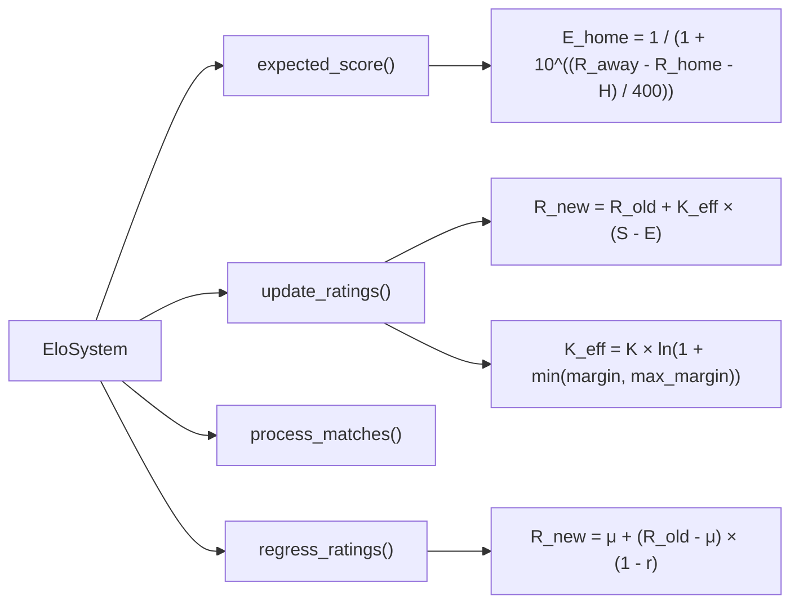
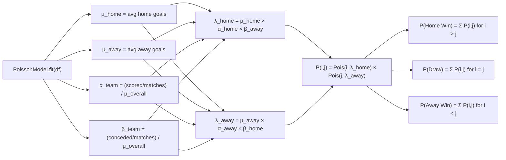
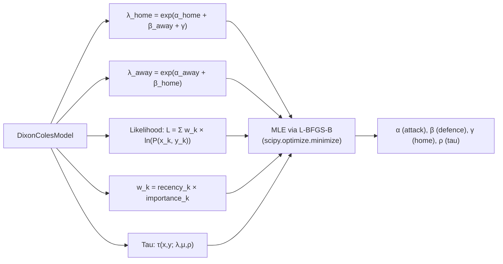

---
tags:
  - football-prediction
  - poisson
  - elo
  - dixon-coles
created: 2026-07-12
---

# 📊 Poisson & Elo Models

> Statistical models for team strength estimation — Elo ratings, Poisson goals prediction, and Dixon-Coles MLE.

See also: [[Ensemble Model]], [[Feature Engineering Pipeline]], [[Config System]]

---

## Elo Rating System

**File:** [[elo.py]]

### Formulas



### Key Features

| Feature | Description |
|---------|-------------|
| **Goal-margin scaling** | Bigger wins → bigger rating changes (log scale, capped at 5) |
| **xG-margin support** | Prefers expected goals margin over actual (less noisy) |
| **Season regression** | Ratings regress 1/3 towards mean between seasons |
| **Host-nation bonus** | +50 Elo points for tournament hosts |
| **Manual adjustments** | `config.elo.adjustments` for domain knowledge |

### Parameters (`config.elo`)

| Parameter | Default | Description |
|-----------|---------|-------------|
| `k` | 32 | Base K-factor |
| `home_advantage` | 100 | Home advantage in Elo points |
| `initial_rating` | 1500 | Starting rating for new teams |
| `regress_to_mean` | True | Regress between seasons |
| `regress_factor` | 1/3 | Regression rate |
| `use_goal_margin` | True | Scale K by goal margin |
| `max_goal_margin` | 5 | Cap on margin scaling |

---

## Poisson Model

**File:** [[poisson_model.py]]

### How It Works



### Equations

| # | Formula | Description |
|---|---------|-------------|
| 1 | μ_home = total_home_goals / total_matches | Baseline home goals |
| 2 | α_team = (scored/matches) / μ_all | Attack strength (>1 = strong) |
| 3 | β_team = (conceded/matches) / μ_all | Defence strength (>1 = weak) |
| 4 | λ_home = μ_home × α_home × β_away | Expected home goals |
| 5 | P(i,j) = Pois(i, λ_home) × Pois(j, λ_away) | Scoreline probability |
| 6 | P(Home) = Σ P(i>j) | Match outcome probabilities |

### API

```python
from src.poisson_model import PoissonModel

model = PoissonModel(min_matches=0, max_goals=8)
model.fit(df)

# Predict a match
result = model.predict("Brazil", "Argentina")
result.expected_home_goals   # 1.83
result.home_win_prob          # 0.48
result.over_2_5_prob          # 0.53
result.btts_prob              # 0.58

# Batch prediction
results_df = model.predict_matches(fixtures_df)

# Feature engineering
df = model.add_poisson_features(df)
```

---

## Dixon-Coles Model

**File:** [[dixon_coles.py]]

Extends Poisson with 3 innovations:

1. **Tau (ρ) correction** — corrects the systematic underestimation of low-scoring results (0-0, 1-0, 0-1, 1-1)
2. **Recency weighting** — older matches contribute less (halflife = ~4 years)
3. **Tournament importance** — World Cup (2.5×) > Continental (2.0×) > Friendly (0.6×)



> **⚠ Note:** Disabled by default (`config.dixon_coles.enabled = False`). MLE optimisation is slow on large datasets. Enable only for small datasets or tournaments with sparse H2H data.
