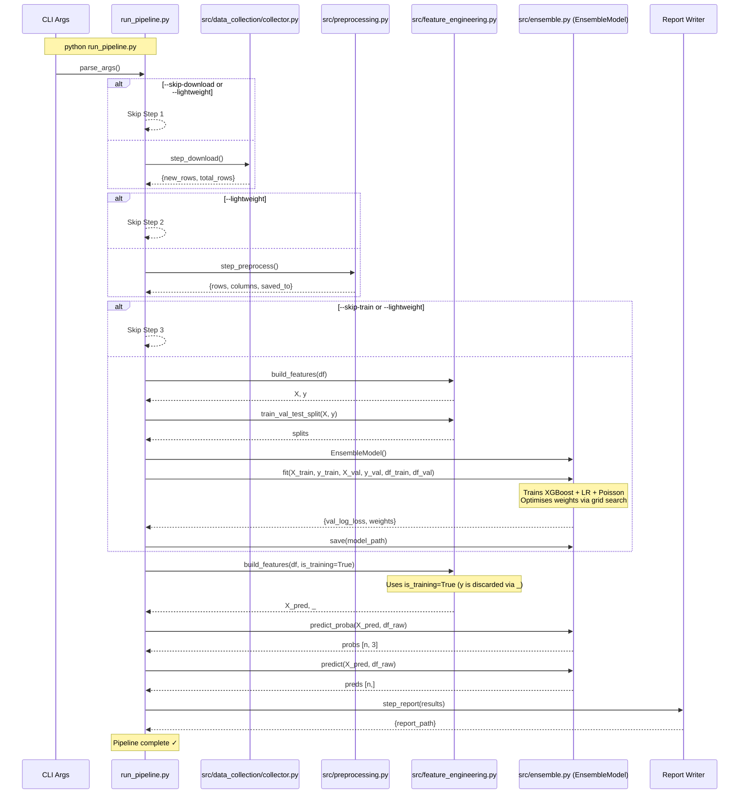
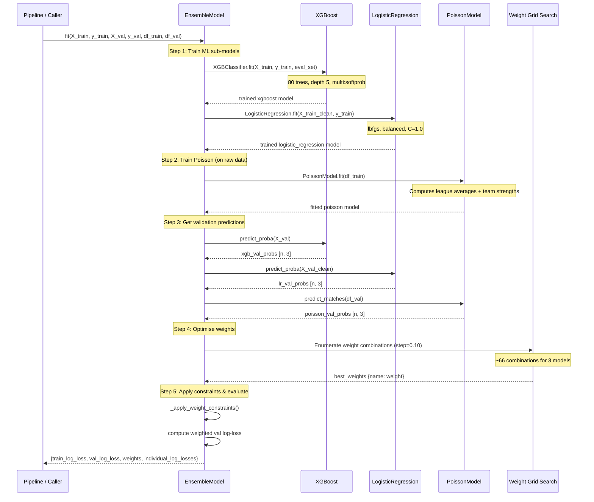
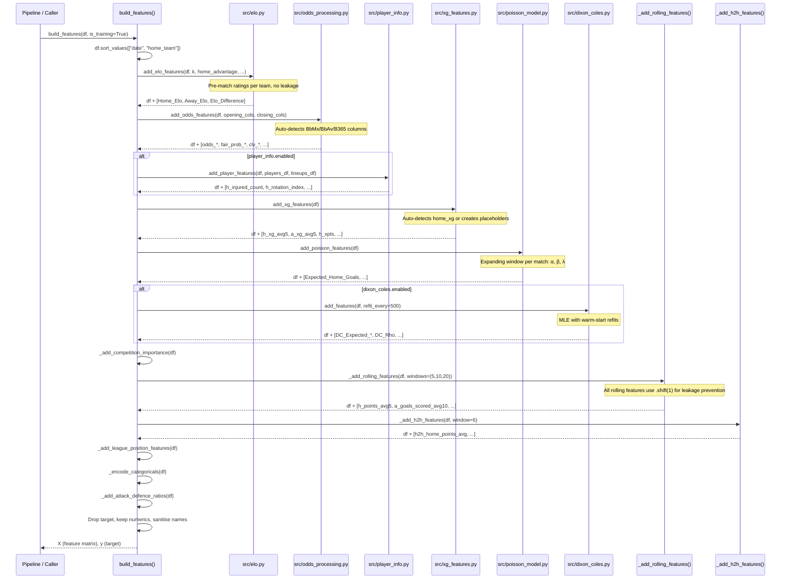
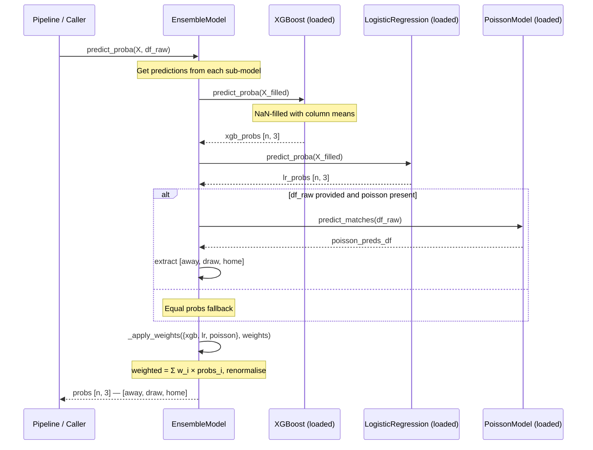
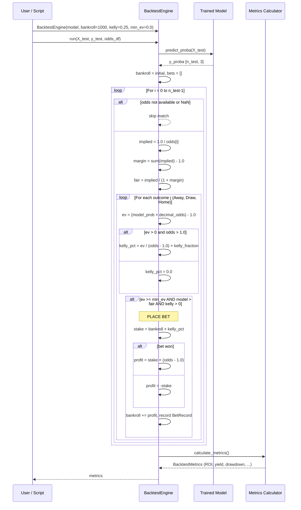

---
tags:
  - football-prediction
  - runtime
  - sequences
  - mermaid
created: 2026-07-12
---

# ⏱ Runtime Sequence Diagrams

> Dynamic views of how modules interact during execution. Read top-to-bottom — each arrow is a method call or data transfer.

See also: [[Architecture Overview]], [[Ensemble Model]], [[Feature Engineering Pipeline]], [[Value Betting & Backtesting]]

---

## 1. Full Pipeline Execution

Shows `run_pipeline.py` orchestrating all 5 steps:



---

## 2. Ensemble Training (fit)

Details the internal flow of `EnsembleModel.fit()`:



---

## 3. Feature Engineering Sequence

Shows `build_features()` calling each sub-module:



---

## 4. Prediction Flow

Shows `EnsembleModel.predict()`:



---

## 5. Value Bet Detection

```mermaid
sequenceDiagram
    participant CALLER as User / Script
    participant VB as compute_value_bets()
    participant LOOP as Per-Match Loop
    
    CALLER->>VB: compute_value_bets(odds, model_probs, team_matches, ...)
    VB->>VB: Validate shapes
    
    loop For each match i
        Note over LOOP: implied = 1.0 / decimal_odds
        Note over LOOP: margin = sum(implied) - 1.0
        Note over LOOP: fair = implied / (1 + margin)
        Note over LOOP: ev = (model_prob × decimal_odds) - 1.0
        
        alt odds > 1.0 and ev > 0
            LOOP->>LOOP: kelly = ev / (odds - 1.0) × kelly_fraction
        else
            LOOP->>LOOP: kelly = 0.0
        end
        
        alt ev >= min_ev AND model > fair AND kelly > 0
            LOOP-->>VB: Append VALUE BET row
        else
            LOOP-->>VB: Append No Value row
        end
    end
    
    VB->>VB: df.sort_values(["positive_ev", "ev"], ascending=[False, False])
    VB-->>CALLER: DataFrame with [match, outcome, ev, kelly_pct, ...]
```

---

## 6. Backtesting Loop


