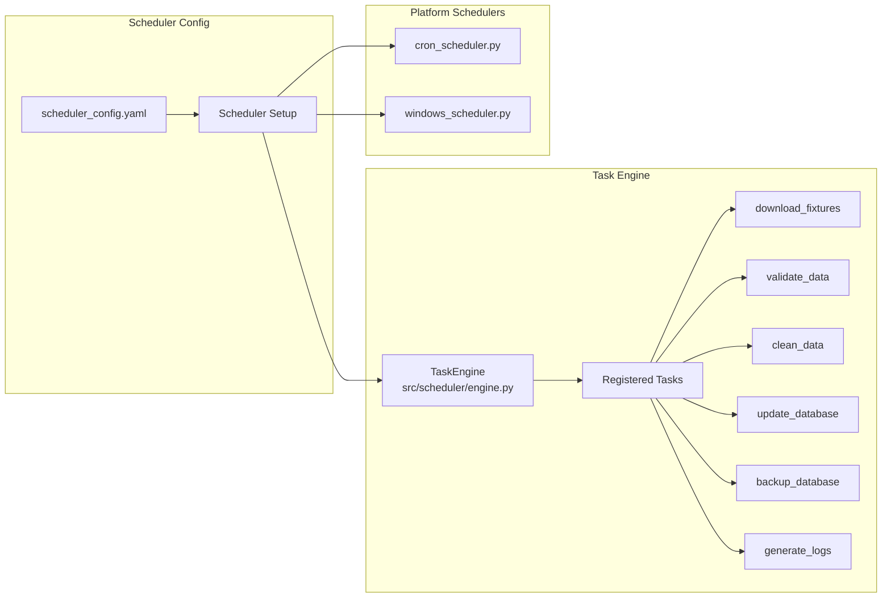
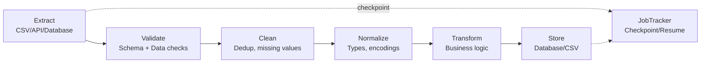
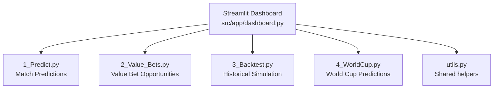

---
tags:
  - football-prediction
  - scheduler
  - dashboard
  - etl
created: 2026-07-12
---

# ⏰ Scheduler, Dashboard & ETL

> Automation, visualisation, and data pipeline infrastructure.

See also: [[Architecture Overview]], [[Config System]], [[Scripts Reference]]

---

## Scheduler System

**Files:** `src/scheduler/engine.py`, `cron_scheduler.py`, `windows_scheduler.py`



### Task Engine Features

| Feature | Description |
|---------|-------------|
| **Dependency resolution** | Topological sort of tasks |
| **Retry logic** | Configurable retry count with linear backoff |
| **Abort-on-failure** | Can stop the chain on first error |
| **Reporting** | `RunReport` with per-task status |

### Built-in Tasks

| Task | Function | Description |
|------|----------|-------------|
| `download_fixtures` | `download_fixtures()` | Fetch latest match data |
| `validate_data` | `validate_data()` | Run validation checks |
| `clean_data` | `clean_data()` | Clean and standardise |
| `update_database` | `update_database()` | Persist to PostgreSQL |
| `backup_database` | `backup_database()` | Create backup |
| `generate_logs` | `generate_logs()` | Generate summary logs |

---

## ETL Pipeline

**File:** `src/etl/pipeline.py`



### Stages

| Stage | Component | Description |
|-------|-----------|-------------|
| Extract | `BaseExtractor` | Read from CSV, API, or database |
| Validate | `DataValidator` | Schema + data integrity checks |
| Clean | `DataCleaner` | Dedup, handle missing values |
| Normalize | `DataNormalizer` | Type coercion, encoding |
| Transform | `DataTransformer` | Business logic transforms |
| Store | `DataStore` | Write to database or file |

### Features

- **Checkpoint/Resume** — can restart from a failed stage
- **Progress reporting** — per-stage status via `ProgressReporter`
- **Job tracking** — `JobTracker` persists state across runs

---

## Dashboard (Streamlit)

**File:** `src/app/dashboard.py`



### Pages

| Page | File | What It Shows |
|------|------|---------------|
| **Predict** | `1_Predict.py` | Match outcome probabilities for upcoming fixtures |
| **Value Bets** | `2_Value_Bets.py` | Positive EV betting opportunities |
| **Backtest** | `3_Backtest.py` | Historical simulation results and charts |
| **World Cup** | `4_WorldCup.py` | World Cup-specific predictions and bracket |

### Launch

```bash
python run_dashboard.py
```
