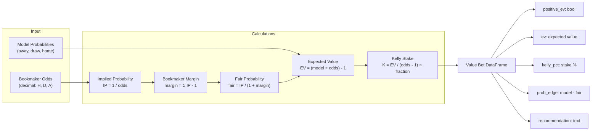
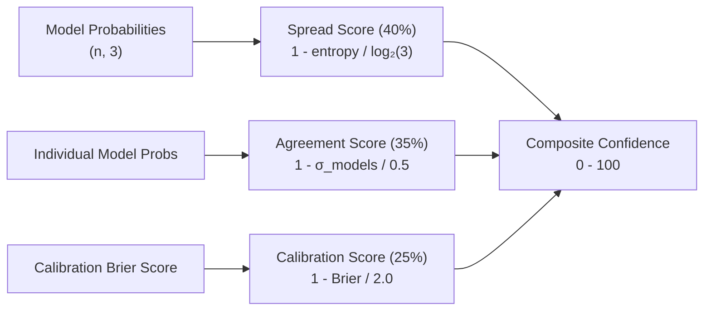
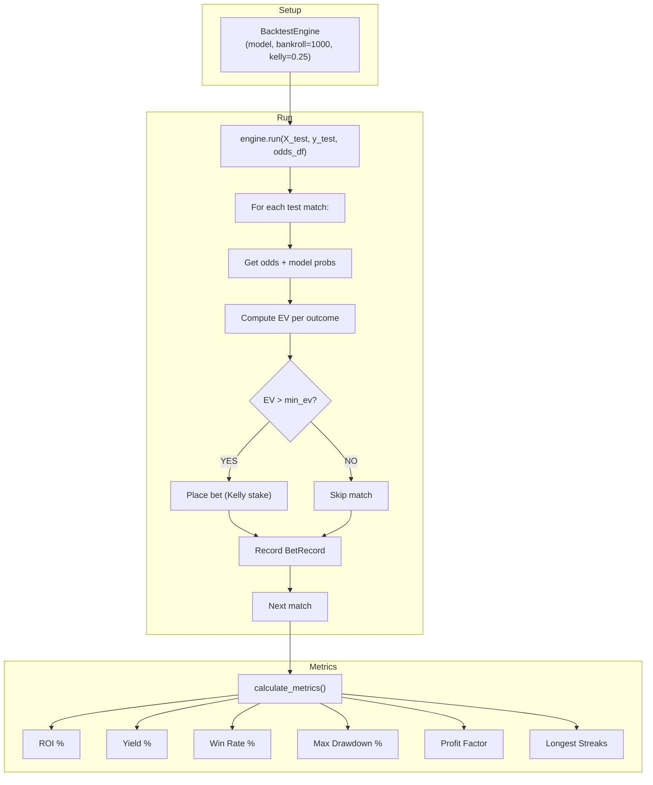

---
tags:
  - football-prediction
  - betting
  - value
  - backtesting
created: 2026-07-12
---

# 💰 Value Betting & Backtesting

> Identify betting opportunities and simulate strategies on historical data.

See also: [[Ensemble Model]], [[Config System]], [[Runtime Sequence Diagrams]]

---

## Value Betting System

**File:** [[value_betting.py]]

### How It Works



### Calculations Explained

| Step | Formula | Example |
|------|---------|---------|
| **Implied Probability** | `IP = 1 / decimal_odds` | Odds 2.10 → IP = 47.6% |
| **Bookmaker Margin** | `margin = Σ IP - 1` | 47.6% + 29.4% + 26.3% - 1 = 3.3% |
| **Fair Probability** | `fair = IP / (1 + margin)` | 47.6% / 1.033 = 46.1% |
| **Expected Value** | `EV = (model × odds) - 1` | (0.52 × 2.10) - 1 = +9.2% |
| **Kelly Stake** | `k = EV / (odds - 1) × fraction` | 9.2% / 1.10 × 0.25 = 2.1% |

### API

```python
from src.value_betting import compute_value_bets

bets = compute_value_bets(
    odds=[[2.10, 3.40, 3.80], [1.95, 3.50, 4.00]],
    model_probs=[[0.52, 0.28, 0.20], [0.48, 0.30, 0.22]],
    team_matches=[("Arsenal", "Chelsea"), ("Liverpool", "Man City")],
    bankroll=1000.0,
    kelly_fraction=0.25,
    min_ev=0.0,
)

good_bets = bets[bets["positive_ev"]]
```

---

## Confidence Scoring

**File:** [[confidence_scoring.py]]



**3 components:** Spread (40%) + Agreement (35%) + Calibration (25%)

---

## Backtesting Engine

**File:** [[backtesting.py]]



### Metrics Explained

| Metric | Formula | What It Tells You |
|--------|---------|-------------------|
| **ROI** | `(final - initial) / initial × 100` | Total return on bankroll |
| **Yield** | `profit / staked × 100` | Return per unit staked |
| **Win Rate** | `wins / total × 100` | % of bets won |
| **Max Drawdown** | `max(peak - trough) / peak × 100` | Worst losing streak |
| **Profit Factor** | `gross_profit / gross_loss` | Risk/reward ratio |

### API

```python
from src.backtesting import BacktestEngine

engine = BacktestEngine(
    model=model,
    initial_bankroll=1000.0,
    kelly_fraction=0.25,
    min_ev=0.0,
)

metrics = engine.run(X_test, y_test, odds_df=odds_df)

engine.print_report()
chart_paths = engine.plot_results(output_dir="reports/backtest")
```
