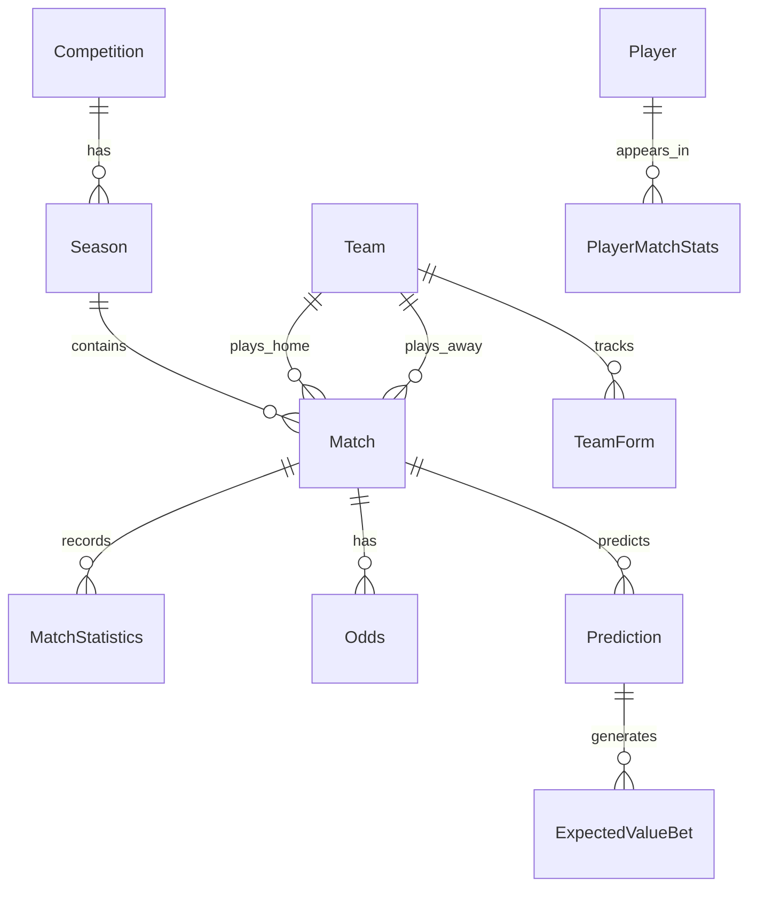

---
tags:
  - football-prediction
  - database
  - er-diagram
  - schema
created: 2026-07-12
---

# 🗄️ ER Diagram

> Database schema reference. The full diagram (21 tables, relationships, indices) is in the parent [er_diagram.md](../er_diagram.md) document.

---

## Quick Summary

The database uses a **PostgreSQL** schema managed via **SQLAlchemy ORM + Alembic** migrations. 21 tables organized into domains:

| Domain | Core Tables |
|--------|-------------|
| **Competitions** | `competition`, `season`, `country` |
| **Matches** | `match`, `match_statistics`, `odds`, `referee`, `stadium`, `weather` |
| **Teams** | `team`, `team_form`, `team_elo_history`, `team_xg_history` |
| **Players** | `player`, `player_match_stats`, `injury`, `transfer`, `lineup` |
| **Predictions** | `prediction`, `expected_value_bet`, `closing_line_value`, `betting_result` |

---

## Key Relationships

---

> **Full reference:** See the complete [ER Diagram with field types and indices](../er_diagram.md) in the project docs folder.
